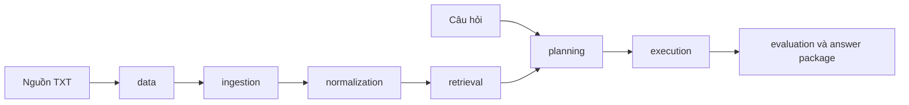

# Kiến trúc hệ thống

## Modular monolith

Dự án được đóng gói thành một Python package `financial_report_qa`. Các module nghiệp vụ nằm
trong cùng tiến trình nhưng có trách nhiệm và interface riêng. Cách này giữ việc phát triển, test
và vận hành đơn giản trong khi vẫn cho phép tách service sau này nếu số liệu vận hành chứng minh
nhu cầu.



## Ranh giới module

| Module | Trách nhiệm |
|---|---|
| `core` | Configuration, error hierarchy và logging dùng chung |
| `data` | Tải dataset, kiểm kê và quản lý dữ liệu raw bất biến |
| `schemas` | Hợp đồng Pydantic ổn định giữa các module |
| `ingestion` | Đọc TXT, nhận diện bảng và giữ provenance |
| `normalization` | Chuẩn hóa công ty, kỳ, chỉ tiêu, số và đơn vị |
| `retrieval` | Tìm và xếp hạng bảng liên quan |
| `planning` | Chuyển câu hỏi thành kế hoạch truy vấn có kiểu |
| `execution` | Biên dịch, tính toán và kiểm chứng kết quả |
| `evaluation` | Metrics, artifacts và phân tích lỗi |

Module chỉ được phụ thuộc vào hợp đồng công khai của module khác. Code nghiệp vụ không import từ
`scripts/`, `tests/`, `data/` hoặc `docs/`.

## Vòng đời dữ liệu

```text
data/raw          dữ liệu nguồn bất biến
data/interim      kết quả trích xuất có thể tái tạo
data/processed    bảng/cell canonical dạng Parquet
data/indexes      index có thể tái tạo
data/manifests    fingerprint và inventory nhỏ
data/qa           câu hỏi và annotation được phép lưu
```

Raw data, generated data, index, model và secret không được commit.

## Quyết định chi tiết

- [ADR-0001: Modular monolith](decisions/0001-modular-monolith.md)
- [Môi trường phát triển](development.md)
- [Tải dữ liệu](data-download.md)
