# Financial Report Assistant — Kế hoạch triển khai 30 ngày

> **For agentic workers:** REQUIRED SUB-SKILL: Use `superpowers:subagent-driven-development` (recommended) or `superpowers:executing-plans` to implement this plan task-by-task. Steps use checkbox (`- [ ]`) syntax for tracking.

**Goal:** Trong 30 ngày, một người xây dựng được sản phẩm hỏi–đáp báo cáo tài chính tiếng Việt có khả năng truy xuất đúng bảng, sinh phép tính Pandas an toàn, trả lời kèm bằng chứng đến ô dữ liệu gốc và xuất đúng định dạng của Stage 2.

**Architecture:** Kiến trúc chính là **Data-first + Controlled LLM**. GTR-lite tìm các bảng có liên quan; TableRAG-lite chỉ dùng một mô hình nhỏ để sinh `FinancialQueryPlan` có kiểu dữ liệu rõ ràng; trình biên dịch quyết định chuyển kế hoạch đó thành Pandas, chạy trong môi trường hạn chế, kiểm tra kết quả và gắn nguồn. Không cho mô hình tự do sinh rồi thực thi Python.

**Tech Stack:** Python 3.11, Pydantic 2, Pandas, PyArrow/Parquet, DuckDB, PyMuPDF, pdfplumber, PaddleOCR/Tesseract khi cần, BM25, sentence-transformers + FAISS CPU, NetworkX, llama.cpp server, Qwen3-4B-Instruct-2507 GGUF Q4_K_M, Streamlit, pytest, Hypothesis, Ruff, mypy.

## Global Constraints

- Người thực hiện: 1 người, 5–10 giờ/ngày.
- Phần cứng chính: RTX 3050 Laptop 6 GB; chỉ thuê A100/Colab khi có bằng chứng việc đó cải thiện điểm số.
- Mô hình sinh chính: 3B–4B lượng tử hóa; không chạy nhiều mô hình sinh cùng lúc.
- Embedding và reranker chạy CPU hoặc theo lô offline; ưu tiên cache.
- Mỗi câu trả lời phải có đường truy vết `answer → execution → cells → table → page → document`.
- Khi thiếu bằng chứng, hệ thống phải từ chối có kiểm soát thay vì đoán.
- Không fine-tune trước khi baseline dữ liệu, retrieval, compiler và bộ đánh giá đã ổn định.
- Không xây authentication, multi-user, hệ thống phân quyền hay backend production trong tháng này.
- Mỗi ngày kết thúc bằng một phiên bản chạy được; không để nhánh chính ở trạng thái hỏng.
- Dataset làm việc hiện tại là ViFinQA tại `data/raw`; raw data chỉ đọc và không commit vào Git.

---

## 0. Trạng thái dữ liệu hiện tại — 2026-08-03

- [x] Đã tải đầy đủ snapshot `AIGuruTinix/ViFinQA` vào `data/raw` và đối chiếu cây tệp với Hugging Face: 1.977/1.977 tệp, không thiếu hoặc thừa.
- [x] Snapshot gồm 1.973 báo cáo TXT, 1.012 câu hỏi JSONL và bảng ánh xạ 100 mã cổ phiếu.
- [x] Dữ liệu báo cáo nằm tại `data/raw/financial_statements/<TICKER>/<YEAR>/<DOCUMENT>/*.txt` và câu hỏi nằm tại `data/raw/questions/questions.jsonl`.
- [x] Thay hoàn toàn notebook legacy bằng `notebooks/01_dataset_profile.ipynb` dành riêng cho ViFinQA.
- [x] Chạy notebook từ đầu đến cuối, lưu thống kê và xác nhận các mốc 1.973 báo cáo, 1.012 câu hỏi, 100 công ty.
- [x] Dùng kết quả profiling để khóa contract inventory, ingestion và normalization trước khi xây index.

Giới hạn cần giữ rõ: bản phát hành này chỉ có câu hỏi, không có đáp án, chương trình tính, gold evidence hoặc train/dev/test chính thức. Các nhãn phát triển phải là dữ liệu nội bộ và không được mô tả là nhãn chính thức của ViFinQA.

---

## 1. Định nghĩa thành công

### 1.1. Phạm vi bắt buộc

Hệ thống phải xử lý được sáu nhóm câu hỏi:

1. Tra cứu trực tiếp một chỉ tiêu theo doanh nghiệp và kỳ.
2. So sánh cùng chỉ tiêu giữa hai kỳ hoặc hai doanh nghiệp.
3. Tính chênh lệch tuyệt đối và tốc độ tăng trưởng.
4. Tính tỷ lệ tài chính từ các chỉ tiêu nguồn, ví dụ ROA, ROE, nợ/vốn chủ sở hữu.
5. Tổng hợp, trung bình, xếp hạng trên một nhóm doanh nghiệp/kỳ.
6. Phát hiện câu hỏi không đủ dữ liệu, không rõ kỳ hoặc không rõ đơn vị và trả lời từ chối.

Mỗi kết quả hợp lệ gồm:

- `id`
- `question`
- `answer`
- `relevant_docs`
- `relevant_tables`
- `pandas_query`
- `csv_path`
- thông tin giải thích và provenance bổ sung cho giao diện

### 1.2. Mục tiêu định lượng

| Hạng mục | Mức tối thiểu để qua cổng | Mục tiêu cuối tháng |
|---|---:|---:|
| Retrieval F2 trên tập kiểm thử khóa | 0,80 | ≥ 0,85 |
| Answer accuracy | 0,85 | ≥ 0,90 |
| Execution accuracy | 0,85 | ≥ 0,90 |
| Kết quả có nguồn hoặc từ chối hợp lệ | 100% | 100% |
| Câu trả lời sai nhưng trình bày tự tin | < 5% | < 2% |
| P95 latency, câu hỏi một bảng trên RTX 3050 | ≤ 15 giây | ≤ 10 giây |
| P95 latency, câu hỏi nhiều bảng | ≤ 25 giây | ≤ 18 giây |
| Kịch bản demo ổn định | 8/10 | 10/10 |

Các ngưỡng trên là mục tiêu kiểm soát nội bộ. Khi có tập chấm chính thức, giữ nguyên tập test khóa và bổ sung một tập thích nghi riêng; không điều chỉnh trực tiếp theo đáp án test.

### 1.3. Ngoài phạm vi

- Tư vấn mua/bán chứng khoán.
- Đọc mọi loại tài liệu doanh nghiệp ngoài báo cáo tài chính.
- Agent tự duyệt web hoặc tự chạy lệnh hệ thống.
- Python tùy ý do LLM sinh ra.
- Fine-tune nhiều mô hình hoặc xây mô hình nền tảng riêng.
- Hạ tầng phục vụ đồng thời nhiều người dùng.

---

## 2. Kiến trúc mục tiêu

```mermaid
flowchart LR
    A["PDF báo cáo tài chính"] --> B["Kiểm kê và băm tệp"]
    B --> C["Tách văn bản, bảng, trang, bbox"]
    C --> D["Chuẩn hóa doanh nghiệp, kỳ, chỉ tiêu, đơn vị"]
    D --> E["Parquet/CSV + provenance"]
    E --> F["BM25 + vector index"]
    E --> G["Đồ thị quan hệ GTR-lite"]
    Q["Câu hỏi"] --> H["Phân tích thực thể và ý định"]
    H --> F
    H --> G
    F --> I["Candidate tables"]
    G --> I
    I --> J["LLM nhỏ sinh FinancialQueryPlan JSON"]
    J --> K["Schema + semantic validator"]
    K --> L["Compiler quyết định sang Pandas"]
    L --> M["Sandbox executor"]
    M --> N["Kiểm tra số, đơn vị, nguồn"]
    N --> O["Trả lời + trích dẫn + file kết quả"]
```



### 2.1. GTR-lite

- Nút chính: bảng tài chính; có thể thêm nút tài liệu và chỉ tiêu ở giai đoạn sau.
- Cạnh có kiểm soát: `same_company`, `same_period`, `same_statement_type`, `adjacent_period`, `shared_metric`, `explained_by_note`.
- Truy xuất: lọc metadata → BM25/vector → hợp nhất điểm → mở rộng một bước trên đồ thị → rerank.
- Không dùng PageRank, hypergraph hoặc graph neural network trong MVP.

### 2.2. TableRAG-lite

- LLM nhận câu hỏi, schema rút gọn và danh sách bảng ứng viên.
- LLM chỉ được tạo một `FinancialQueryPlan` JSON; không được tạo Python tự do.
- Các phép toán phiên bản 1: `lookup`, `compare`, `difference`, `growth_rate`, `ratio`, `average`, `sum`, `rank`.
- Pydantic kiểm tra cú pháp; semantic validator kiểm tra chỉ tiêu, kỳ, đơn vị và bảng nguồn.
- Compiler có whitelist chuyển plan thành các thao tác Pandas.

### 2.3. Giao diện cốt lõi

```python
class FinancialQueryPlan(BaseModel):
    operation: Literal[
        "lookup", "compare", "difference", "growth_rate", "ratio", "average", "sum", "rank"
    ]
    companies: list[str]
    periods: list[str]
    metrics: list[str]
    filters: dict[str, str | int | float]
    numerator_metric: str | None = None
    denominator_metric: str | None = None
    top_k: int | None = None
    expected_unit: str | None = None
    candidate_table_ids: list[str]


class EvidenceRef(BaseModel):
    doc_id: str
    table_id: str
    cell_ids: list[str]
    page: int
    bbox: tuple[float, float, float, float] | None


class AnswerPackage(BaseModel):
    id: str
    question: str
    answer: str
    relevant_docs: list[str]
    relevant_tables: list[str]
    pandas_query: str
    csv_path: str
    evidence: list[EvidenceRef]
    status: Literal["answered", "abstained", "error"]
```

---

## 3. Cấu trúc thư mục

```text
financial-assistant/
├── README.md
├── pyproject.toml
├── uv.lock
├── .env.example
├── .gitignore
├── configs/
│   ├── base.yaml
│   ├── local_rtx3050.yaml
│   └── evaluation.yaml
├── data/
│   ├── README.md
│   ├── manifests/
│   │   ├── documents.csv
│   │   └── collection_log.jsonl
│   ├── raw/                    # bất biến, không sửa PDF gốc
│   ├── quarantine/             # lỗi tải, mã hóa, hỏng, thiếu trang
│   ├── interim/
│   │   ├── pages/
│   │   ├── detected_tables/
│   │   └── ocr/
│   ├── processed/
│   │   ├── documents.parquet
│   │   ├── tables.parquet
│   │   ├── cells.parquet
│   │   ├── graph_edges.parquet
│   │   └── metric_dictionary.csv
│   ├── qa/
│   │   ├── train.jsonl
│   │   ├── dev.jsonl
│   │   ├── test_locked.jsonl
│   │   └── adjudication_log.jsonl
│   └── indexes/
│       ├── bm25/
│       ├── dense/
│       └── graph/
├── models/                     # GGUF và cache; không commit
├── src/financial_report_qa/
│   ├── __init__.py
│   ├── config.py
│   ├── schemas/
│   │   ├── documents.py
│   │   ├── tables.py
│   │   ├── query_plan.py
│   │   └── answer.py
│   ├── ingestion/
│   │   ├── collector.py
│   │   ├── inventory.py
│   │   ├── pdf_inspector.py
│   │   ├── text_extractor.py
│   │   ├── table_extractor.py
│   │   └── ocr_router.py
│   ├── normalization/
│   │   ├── company.py
│   │   ├── periods.py
│   │   ├── metrics.py
│   │   ├── units.py
│   │   └── provenance.py
│   ├── retrieval/
│   │   ├── lexical.py
│   │   ├── dense.py
│   │   ├── fusion.py
│   │   ├── graph.py
│   │   └── reranker.py
│   ├── planning/
│   │   ├── entity_parser.py
│   │   ├── llm_client.py
│   │   ├── prompts.py
│   │   ├── planner.py
│   │   └── validator.py
│   ├── execution/
│   │   ├── compiler.py
│   │   ├── operations.py
│   │   ├── sandbox.py
│   │   └── verifier.py
│   ├── pipeline.py
│   ├── export.py
│   └── telemetry.py
├── app/
│   ├── streamlit_app.py
│   ├── components.py
│   └── styles.css
├── scripts/
│   ├── collect_documents.py
│   ├── build_dataset.py
│   ├── build_indexes.py
│   ├── create_qa_set.py
│   ├── evaluate.py
│   ├── benchmark_models.py
│   └── export_submission.py
├── tests/
│   ├── fixtures/
│   ├── unit/
│   ├── integration/
│   ├── golden/
│   ├── security/
│   └── performance/
├── artifacts/
│   ├── evaluations/
│   ├── error_analysis/
│   └── demo/
├── submissions/
└── docs/
    ├── architecture.md
    ├── dataset_card.md
    ├── error_taxonomy.md
    └── demo_script.md
```

Quy tắc lưu trữ:

- `data/raw/` chỉ thêm mới; tên file thay đổi không được thay nội dung đã băm.
- Không commit PDF, model, index và secrets. Commit manifest, schema, mã nguồn và mẫu dữ liệu nhỏ được phép phân phối.
- Mọi artifact đánh giá có `run_id`, Git commit, config, model, dataset fingerprint và thời gian chạy.
- `submissions/` chỉ chứa gói nộp đã được kiểm tra bằng script; không dùng làm thư mục làm việc.

---

## 4. Thiết lập môi trường

### 4.1. Yêu cầu máy

- Windows 11, Python 3.11 x64, Git và `uv`.
- NVIDIA driver nhận RTX 3050 6 GB.
- Khoảng trống đề nghị: 40–80 GB cho PDF, Parquet, index và model.
- `llama.cpp` chạy ở chế độ server để tách phần suy luận khỏi ứng dụng Python.

### 4.2. Khởi tạo dự án

```powershell
New-Item -ItemType Directory -Path financial-assistant
Set-Location financial-assistant
git init
uv venv --python 3.11
.\.venv\Scripts\Activate.ps1
uv init --name financial-assistant --python 3.11
```

Nhóm dependency cần ghi vào `pyproject.toml`:

- Core: `pydantic`, `pydantic-settings`, `pyyaml`, `pandas`, `pyarrow`, `duckdb`, `numpy`.
- PDF: `pymupdf`, `pdfplumber`, `pypdf`, `pillow`.
- Retrieval: `bm25s`, `sentence-transformers`, `faiss-cpu`, `networkx`, `rapidfuzz`.
- App: `streamlit`, `httpx`, `orjson`.
- Quality: `pytest`, `pytest-cov`, `hypothesis`, `ruff`, `mypy`.
- OCR là extra riêng để tránh làm môi trường nền quá nặng: `paddleocr` và runtime phù hợp CPU/GPU.

Sau khi tạo `pyproject.toml`:

```powershell
uv sync --frozen --extra dev
Copy-Item .env.example .env
uv run --frozen --no-sync pytest
uv run --frozen --no-sync ruff check .
```

### 4.3. Cấu hình runtime

`.env.example` chỉ chứa tên biến, không chứa khóa thật:

```dotenv
APP_ENV=local
DATA_ROOT=data
LLM_BASE_URL=http://127.0.0.1:8080/v1
LLM_MODEL=qwen3-4b-instruct-2507-q4_k_m
LLM_TIMEOUT_SECONDS=30
LLM_MAX_OUTPUT_TOKENS=160
EMBEDDING_MODEL=BAAI/bge-m3
OCR_ENABLED=true
```

`configs/local_rtx3050.yaml`:

```yaml
llm:
  temperature: 0.0
  context_length: 4096
  max_output_tokens: 160
  json_schema_constrained: true
retrieval:
  lexical_top_k: 30
  dense_top_k: 30
  fused_top_k: 12
  graph_hops: 1
  final_top_k: 6
execution:
  timeout_seconds: 5
  max_rows: 100000
  allow_operations:
    - lookup
    - compare
    - difference
    - growth_rate
    - ratio
    - average
    - sum
    - rank
```

### 4.4. Mô hình và chiến lược phần cứng

1. Mặc định: Qwen3-4B-Instruct-2507 GGUF Q4_K_M, context 4.096, temperature 0, đầu ra tối đa 160 token.
2. Challenger: Qwen3.5-4B Q4_K_M với chế độ suy luận dài tắt; chỉ giữ nếu tăng execution/plan accuracy đủ rõ.
3. Challenger tiếng Việt: SaoLa-3B-Instruct hoặc PhoGPT-4B-Chat, dùng cùng prompt và cùng tập test.
4. Embedding mặc định: BGE-M3 chạy offline theo lô trên CPU. Nếu tốc độ index quá chậm, thử `multilingual-e5-small` và so F2.
5. Chỉ thuê A100 khi một trong hai điều kiện đúng:
   - fine-tune/LoRA đã có tập ít nhất 500 plan chất lượng cao và baseline còn lỗi lập kế hoạch đáng kể;
   - benchmark chứng minh model lớn hơn tăng ≥ 3 điểm phần trăm accuracy trên test khóa.

---

## 5. Dataset ViFinQA và kế hoạch dữ liệu kế tiếp

### 5.1. Snapshot đang sử dụng

| Thành phần | Quy mô | Đường dẫn | Vai trò |
|---|---:|---|---|
| Báo cáo OCR TXT | 1.973 tệp | `data/raw/financial_statements/` | Corpus truy hồi và trích bảng |
| Câu hỏi tiếng Việt | 1.012 dòng | `data/raw/questions/questions.jsonl` | Phân tích intent và benchmark question-only |
| Danh mục doanh nghiệp | 100 mã | `data/raw/code_stock.csv` | Chuẩn hóa mã và tên công ty |
| Dataset card | 1 tệp | `data/raw/README.md` | Contract, nguồn, license và giới hạn |

Notebook profiling phải quét metadata của toàn bộ báo cáo nhưng chỉ đọc nội dung một mẫu xác định bằng seed và giới hạn byte. Không mở rộng thu thập PDF trước khi hoàn tất inventory và xác định khoảng trống thực sự của snapshot này.

### 5.2. Manifest tài liệu

`data/manifests/documents.csv` có các cột bắt buộc:

```text
doc_id,company_code,company_name,report_year,period_end,
statement_scope,report_type,audit_status,source_url,downloaded_at,
local_path,sha256,file_size_bytes,page_count,pdf_kind,
language,version,is_latest,collection_status,notes
```

Quy tắc:

- `doc_id = company_code + period_end + scope + report_type + sha256[:8]`.
- Ghi URL gốc và thời điểm tải; không chỉ ghi trang tổng hợp.
- Kiểm tra SHA-256 để phát hiện trùng nội dung dù tên file khác nhau.
- Nếu cùng kỳ có bản sửa đổi, giữ cả hai, đặt `is_latest`, không ghi đè.
- File hỏng/mã hóa/thiếu trang được chuyển logic sang `quarantine` và có lý do trong log.
- Chỉ dùng nguồn công khai hợp pháp; lưu điều khoản/ghi chú nguồn trong dataset card.

### 5.3. Schema dữ liệu đã xử lý

`documents.parquet`:

```text
doc_id, company_code, report_year, period_end, scope, report_type,
source_url, sha256, page_count, pdf_kind, extraction_status
```

`tables.parquet`:

```text
table_id, doc_id, page_start, page_end, bbox_json, title_raw,
statement_type, unit_raw, unit_normalized, extraction_method,
row_count, column_count, quality_score, csv_path
```

`cells.parquet`:

```text
cell_id, table_id, row_idx, col_idx, row_label_raw, row_label_canonical,
column_label_raw, column_label_canonical, value_raw, value_numeric,
period, unit, page, bbox_json, extraction_confidence
```

`graph_edges.parquet`:

```text
src_table_id, dst_table_id, relation, weight, evidence_json
```

`metric_dictionary.csv`:

```text
metric_id,canonical_name_vi,aliases_vi,statement_type,value_type,
unit_family,sign_convention,formula,required_metrics
```

### 5.4. Quy trình thu thập và kiểm soát chất lượng

- [ ] Lập danh sách nguồn và doanh nghiệp/kỳ trước khi tải.
- [ ] Tải vào `data/raw/<company>/<year>/`; tạo manifest và hash ngay lập tức.
- [ ] Chạy inventory: mở được, số trang, có text hay scan, có mật khẩu, có trùng hash.
- [ ] Lấy mẫu ít nhất 3 trang/báo cáo: một báo cáo chính, một bảng nhiều cột, một trang thuyết minh.
- [ ] Chấm `pdf_kind`: `digital`, `hybrid`, `scanned`.
- [ ] Trích bảng; với bảng có `quality_score < 0.75`, đưa vào hàng kiểm tra thủ công.
- [ ] So ba tổng kiểm tra khi có: tổng tài sản, tổng nguồn vốn, lợi nhuận sau thuế.
- [ ] Đối chiếu đơn vị trên tiêu đề/trang; không suy đoán đơn vị từ độ lớn của số.
- [ ] Ghi provenance cho từng cell; cell không có trang/table không được đưa vào gold QA.
- [ ] Cập nhật `docs/dataset_card.md` mỗi khi thêm nguồn hoặc thay đổi quy tắc.

### 5.5. Bộ câu hỏi chuẩn

Mục tiêu cuối tháng: tối thiểu 180 câu, trong đó:

- 45 lookup.
- 35 compare/difference.
- 35 growth rate.
- 30 ratio.
- 20 aggregate/rank.
- 15 unanswerable/ambiguous/adversarial.

Mỗi bản ghi `questions.jsonl` có:

```json
{
  "id": "qa_0001",
  "question": "...",
  "intent": "growth_rate",
  "gold_docs": ["..."],
  "gold_tables": ["..."],
  "gold_cells": ["..."],
  "gold_plan": {},
  "gold_answer": "...",
  "gold_numeric_value": 0.0,
  "unit": "VND",
  "tolerance": 0.01,
  "difficulty": "medium",
  "split": "dev"
}
```

Chia tập theo doanh nghiệp–kỳ, không chia ngẫu nhiên từng câu:

- Train/prompt examples: 50% doanh nghiệp–kỳ.
- Dev: 25% doanh nghiệp–kỳ.
- Test khóa: 25% doanh nghiệp–kỳ; không mở để sửa prompt hằng ngày.
- Một mình vẫn làm “hai lượt”: gán nhãn lần đầu, để cách ít nhất một ngày rồi kiểm tra lại từ PDF và công thức; ghi sửa đổi vào `adjudication_log.jsonl`.

### 5.6. Khi dữ liệu chính thức xuất hiện

Trong 24 giờ đầu:

- [ ] Sao lưu bất biến, tạo hash và manifest toàn bộ.
- [ ] Thống kê số tài liệu, trang, doanh nghiệp, kỳ, tỷ lệ scan và lỗi mở file.
- [ ] Chạy pipeline trên mẫu phân tầng 10 tài liệu, không chạy toàn bộ ngay.
- [ ] So schema chính thức với schema hiện tại; tạo adapter thay vì sửa dữ liệu gốc.

Trong 24–48 giờ:

- [ ] Chạy extraction toàn bộ; tách lỗi vào quarantine.
- [ ] Kiểm tra 30 bảng đại diện và ba tổng kiểm tra tài chính.
- [ ] Xây lại index có version; giữ index proxy để so sánh hồi quy.

Trong 48–72 giờ:

- [ ] Chạy bộ regression hiện có trên dữ liệu tương thích.
- [ ] Tạo 30–50 QA thích nghi nhưng không trộn vào test khóa.
- [ ] Chỉ chỉnh parser/normalizer theo lỗi mang tính hệ thống.

---

## 6. Kế hoạch thực hiện 30 ngày

Mỗi ngày có một đầu ra có thể kiểm chứng. “Hoàn tất” nghĩa là test tương ứng chạy qua và artifact đã được lưu.

### Tuần 1 — Nền móng dữ liệu và baseline

#### Ngày 1 — Repository, hợp đồng dữ liệu, phép đo

- [ ] Tạo cấu trúc thư mục, `pyproject.toml`, config và pre-commit chất lượng.
- [ ] Viết Pydantic schema cho document, table, cell, query plan và answer.
- [ ] Viết `docs/architecture.md` và `docs/error_taxonomy.md` phiên bản 1.
- [ ] Tạo 5 fixture nhỏ bằng dữ liệu giả, không phụ thuộc PDF thật.
- [ ] Test: schema từ chối thiếu `doc_id`, unit không hợp lệ và operation ngoài whitelist.
- **Đầu ra:** `uv run pytest tests/unit/schemas -q` qua; pipeline rỗng khởi động được.

#### Ngày 2 — Collector và inventory

- [x] Tải và xác minh đầy đủ snapshot ViFinQA trong `data/raw`.
- [x] Chạy notebook profile cho báo cáo, câu hỏi và danh mục công ty.
- [x] Xác định đường dẫn lỗi, file rỗng, ID câu hỏi thiếu/trùng và ticker không khớp.
- [ ] Chốt schema inventory/manifest từ bằng chứng profiling; raw snapshot không bị ghi đè.
- **Đầu ra:** notebook thực thi thành công, hiển thị đúng 1.973 báo cáo, 1.012 câu hỏi và 100 công ty.

#### Ngày 3 — PDF routing và trích xuất thô

- [ ] Phân loại digital/hybrid/scanned dựa trên mật độ text và ảnh.
- [ ] Trích text theo trang, bbox, rotation.
- [ ] Trích bảng digital bằng pdfplumber/PyMuPDF; OCR chỉ chạy với trang cần thiết.
- [ ] Lưu extraction report và thumbnail trang lỗi.
- **Đầu ra:** ≥ 90% trang digital có text; scan đi đúng nhánh OCR.

#### Ngày 4 — Chuẩn hóa bảng

- [ ] Chuẩn hóa tiêu đề nhiều dòng, cột kỳ, dấu âm ngoặc, dấu phân cách và null.
- [ ] Phát hiện đơn vị theo table/page/document với mức ưu tiên rõ ràng.
- [ ] Map statement type và tên chỉ tiêu qua từ điển alias.
- [ ] Test các giá trị `1.234`, `(1.234)`, `-`, `N/A`, đơn vị nghìn/triệu/tỷ.
- **Đầu ra:** bảng Pilot sinh CSV/Parquet nhất quán, không mất raw value.

#### Ngày 5 — Provenance và kiểm tra tài chính

- [ ] Sinh `cell_id`, page, bbox và chuỗi provenance.
- [ ] Viết kiểm tra `Tổng tài sản ≈ Tổng nguồn vốn` có tolerance theo đơn vị.
- [ ] Phát hiện cell trùng, header lệch và tổng không khớp.
- **Đầu ra:** chọn một con số bất kỳ từ processed và truy ngược được tới trang PDF.

#### Ngày 6 — Pilot dataset và gold QA đầu tiên

- [ ] Hoàn tất khoảng 15 báo cáo Pilot.
- [ ] Tạo 30 câu gold đủ 6 nhóm, ưu tiên lookup/compare/growth.
- [ ] Viết evaluator retrieval, numeric answer và execution.
- **Đầu ra:** báo cáo baseline không LLM; ít nhất lookup trực tiếp chạy end-to-end.

#### Ngày 7 — Review cổng tuần 1

- [ ] Đo tỷ lệ extraction thành công theo loại PDF và statement.
- [ ] Chọn 10 lỗi tốn điểm nhất, phân loại theo taxonomy.
- [ ] Sửa lỗi schema/provenance trước khi mở rộng dữ liệu.
- [ ] Đóng version `dataset-pilot-v1` bằng fingerprint.
- **Cổng:** ≥ 85% bảng chính Pilot dùng được và 100% gold cells có provenance. Nếu không đạt, dùng ngày 8 để sửa extraction, chưa làm dense retrieval.

### Tuần 2 — Retrieval và GTR-lite

#### Ngày 8 — BM25 baseline

- [ ] Xây document cho từng bảng từ title, statement, metric aliases, company, period và unit.
- [ ] Cài metadata filter trước BM25.
- [ ] Log top-k cùng thành phần điểm.
- **Đầu ra:** Recall@10 và F2 trên 30 câu gold.

#### Ngày 9 — Dense retrieval

- [ ] Sinh embedding theo lô, lưu model/version và fingerprint corpus.
- [ ] Index FAISS CPU; ánh xạ index row về `table_id` bất biến.
- [ ] Cache embedding câu hỏi.
- **Đầu ra:** so BM25 và dense độc lập theo từng intent.

#### Ngày 10 — Fusion và entity parser

- [ ] Parse company, year/quarter, metric aliases bằng rule + dictionary.
- [ ] Hợp nhất BM25/dense bằng Reciprocal Rank Fusion.
- [ ] Cho điểm phạt khi company/period mâu thuẫn.
- **Đầu ra:** fused retrieval không kém BM25 trên test hiện có.

#### Ngày 11 — Xây graph

- [ ] Tạo cạnh GTR-lite từ metadata và metric overlap.
- [ ] Unit test quan hệ đối xứng/bất đối xứng và không tạo self-loop ngoài chủ đích.
- [ ] Lưu lý do tạo cạnh trong `evidence_json`.
- **Đầu ra:** graph build tái lập được từ cùng dataset fingerprint.

#### Ngày 12 — Graph expansion và rerank

- [ ] Mở rộng đúng một hop từ top candidates.
- [ ] Giới hạn fan-out và loại node mâu thuẫn metadata.
- [ ] Rerank bằng feature rõ ràng trước; cross-encoder chỉ là challenger.
- **Đầu ra:** câu multi-period/multi-table tăng Recall@k mà latency không vượt ngân sách.

#### Ngày 13 — Retrieval evaluation

- [ ] Nâng gold QA lên 70 câu.
- [ ] Tính Precision, Recall, F2, MRR, Recall@3/5/10 theo intent.
- [ ] Xuất failure cases với question, gold, predicted, scores, reason.
- **Đầu ra:** `artifacts/evaluations/retrieval-*.json` và `.md`.

#### Ngày 14 — Review cổng tuần 2

- [ ] Hoàn thành dataset Representative khoảng 60 báo cáo nếu collector ổn.
- [ ] Ablation: BM25; dense; fusion; fusion + graph.
- [ ] Giữ graph chỉ khi tăng F2 hoặc multi-table recall có ý nghĩa và chi phí chấp nhận được.
- **Cổng:** retrieval F2 ≥ 0,80 và Recall@10 ≥ 0,90. Nếu không đạt, ưu tiên normalization/aliases hơn đổi model.

### Tuần 3 — TableRAG-lite, compiler và kiểm chứng

#### Ngày 15 — FinancialQueryPlan

- [ ] Chốt schema, error codes và JSON examples cho 8 operation.
- [ ] Viết semantic validator: số company/period/metric phù hợp operation.
- [ ] Viết property tests cho các tổ hợp field không hợp lệ.
- **Đầu ra:** mọi plan không hợp lệ bị từ chối trước execution.

#### Ngày 16 — Deterministic parsing và ontology

- [ ] Mở rộng dictionary alias, viết tắt, tên doanh nghiệp và kỳ tiếng Việt.
- [ ] Xử lý các từ “tăng bao nhiêu”, “gấp mấy lần”, “biên”, “bình quân”, “cao nhất”.
- [ ] Tạo ambiguity flags thay vì chọn bừa.
- **Đầu ra:** rule baseline tạo đúng plan cho ≥ 60% câu đơn giản.

#### Ngày 17 — LLM planner

- [ ] Tạo OpenAI-compatible client tới llama.cpp với timeout/retry giới hạn.
- [ ] Prompt chỉ chứa schema rút gọn, candidate tables và 6–10 few-shot tốt.
- [ ] Bật grammar/JSON schema; temperature 0.
- [ ] Một lần repair JSON tối đa; sau đó abstain.
- **Đầu ra:** plan accuracy và invalid JSON rate trên QA dev.

#### Ngày 18 — Deterministic compiler

- [ ] Mỗi operation có một hàm compiler riêng.
- [ ] Chỉ cho phép DataFrame đã chọn, cột đã whitelist và scalar operation.
- [ ] Sinh `pandas_query` dễ đọc để nộp bài và audit.
- [ ] Golden tests cho dấu âm, null, duplicate row, nhiều đơn vị và chia cho 0.
- **Đầu ra:** cùng plan + dữ liệu luôn tạo cùng kết quả.

#### Ngày 19 — Sandbox executor

- [ ] Không dùng `eval`/`exec` trên chuỗi LLM.
- [ ] Giới hạn số dòng, thời gian, bộ nhớ hợp lý và operation whitelist.
- [ ] Cấm filesystem ngoài data path, network, subprocess và import tùy ý.
- [ ] Viết security tests với prompt injection và plan độc hại.
- **Đầu ra:** các payload độc hại bị từ chối có error code.

#### Ngày 20 — Answer verifier và citation

- [ ] Kiểm tra answer numeric với kết quả executor và tolerance.
- [ ] Chuẩn hóa scale/unit; phát hiện trộn nghìn/triệu/tỷ và phần trăm/tỷ lệ.
- [ ] Xác nhận mọi input cell đều thuộc bảng đã retrieve.
- [ ] Sinh câu trả lời theo template; LLM chỉ được diễn đạt khi số đã khóa.
- **Đầu ra:** không có số mới do LLM tự thêm vào câu trả lời.

#### Ngày 21 — E2E và review cổng tuần 3

- [ ] Nâng bộ QA lên ít nhất 120 câu.
- [ ] Chạy câu hỏi từ text → retrieval → plan → execution → answer package.
- [ ] Phân lỗi thành retrieval, planning, normalization, execution, verification.
- **Cổng:** answer và execution accuracy ≥ 0,85; invalid plan < 5%; 100% answered có source. Nếu retrieval sai là lỗi chủ đạo, không fine-tune planner.

### Tuần 4 — Sản phẩm, tối ưu, kiểm thử và nộp bài

#### Ngày 22 — Streamlit UI

- [ ] Trang chat, ví dụ câu hỏi và trạng thái xử lý rõ ràng.
- [ ] Hiện answer trước, sau đó nguồn, phép tính và dữ liệu trung gian dạng mở rộng.
- [ ] Có trạng thái không đủ bằng chứng, lỗi file và timeout dễ hiểu.
- **Đầu ra:** người không kỹ thuật dùng được demo mà không mở terminal.

#### Ngày 23 — Audit view

- [ ] Hiển thị bảng/cell nguồn, company, period, unit, page và confidence.
- [ ] Nếu có ảnh trang, highlight bbox của bằng chứng.
- [ ] Hiển thị computation trace ngắn gọn, không lộ prompt nội bộ.
- **Đầu ra:** giám khảo truy vết được ít nhất 10 kịch bản demo.

#### Ngày 24 — Export và contract submission

- [ ] Xuất đúng bảy field bắt buộc và encoding UTF-8.
- [ ] Xác nhận `csv_path` tồn tại, `pandas_query` chạy lại được.
- [ ] Validator kiểm tra ID duy nhất, field rỗng và source không tồn tại.
- **Đầu ra:** một gói submission thử nghiệm vượt contract tests.

#### Ngày 25 — Benchmark model

- [ ] So tối đa ba model trên cùng prompt, QA, seed và giới hạn token.
- [ ] Đo plan accuracy, invalid JSON, latency P50/P95, VRAM và tỷ lệ fallback.
- [ ] Chọn model theo điểm tổng: 50% accuracy, 25% execution, 15% latency, 10% stability.
- **Đầu ra:** quyết định model có số liệu; không chọn theo cảm giác.

#### Ngày 26 — Cổng fine-tuning

- [ ] Chỉ chuẩn bị QLoRA nếu planning vẫn là nhóm lỗi lớn nhất sau khi retrieval đúng.
- [ ] Yêu cầu tối thiểu 500 plan đã kiểm tra, dev/test tách theo company–period.
- [ ] Thuê A100 theo phiên ngắn; log config, seed, checkpoint và chi phí.
- [ ] Nếu không đủ điều kiện, dùng ngày này tăng QA, aliases và regression tests.
- **Đầu ra:** model tinh chỉnh phải tăng ≥ 3 điểm phần trăm plan accuracy và không làm giảm execution; nếu không, quay lại base model.

#### Ngày 27 — Hiệu năng và độ ổn định

- [ ] Cache parse, embedding, retrieval và bảng đã tải.
- [ ] Rút context theo schema/table rows liên quan; không đưa toàn bộ PDF vào prompt.
- [ ] Đo cold/warm latency và VRAM trên RTX 3050.
- [ ] Kiểm thử OOM, LLM timeout và restart server; fallback không làm hỏng app.
- **Đầu ra:** P95 đạt ngưỡng hoặc có thông báo chờ/fallback rõ ràng.

#### Ngày 28 — Adversarial và regression

- [ ] Hoàn thành ≥ 180 QA và khóa test.
- [ ] Chạy typo tiếng Việt, thiếu dấu, kỳ mơ hồ, metric gần nghĩa, prompt injection, chia 0, dữ liệu thiếu.
- [ ] Chạy toàn bộ unit/integration/golden/security/performance tests.
- [ ] Sửa theo mức ảnh hưởng điểm số, không thêm tính năng mới.
- **Đầu ra:** release candidate 1 và báo cáo lỗi còn lại.

#### Ngày 29 — Demo, slide và dry run

- [ ] Chọn 10 câu demo: đơn giản, nhiều kỳ, tỷ lệ, ranking, scan, và abstain.
- [ ] Viết `docs/demo_script.md` với thời lượng và phương án khi model timeout.
- [ ] Hoàn thiện slide: vấn đề, kiến trúc, điểm khác biệt, đánh giá, ablation, demo, giới hạn.
- [ ] Chạy quy trình nộp từ máy sạch/config sạch.
- **Đầu ra:** video thử, slide hoàn chỉnh và submission RC2.

#### Ngày 30 — Freeze và bàn giao

- [ ] Không thêm feature; chỉ sửa lỗi chặn nộp.
- [ ] Chạy final evaluation, lưu dataset fingerprint và model hash.
- [ ] Kiểm tra README từ đầu trên môi trường mới.
- [ ] Đóng gói source, requirements/lock, submission, slide, video và model instructions.
- [ ] Lưu bản dự phòng cục bộ và cloud; xác nhận mở được từng tệp.
- **Đầu ra:** release `v1.0-stage2` có thể tái lập.

---

## 7. Các task kỹ thuật và tiêu chí hoàn tất

### Task A — Data contracts và configuration

**Files:** `src/financial_report_qa/schemas/*.py`, `src/financial_report_qa/core/config.py`, `configs/*.yaml`, `tests/unit/schemas/`.

- [ ] Viết test schema trước.
- [ ] Cài model Pydantic, serialization và stable IDs.
- [ ] Test round-trip JSON/Parquet metadata.
- [ ] Chạy `uv run pytest tests/unit/schemas -q`.
- [ ] Commit: `feat: define financial data and answer contracts`.

### Task B — Ingestion có provenance

**Files:** `src/financial_report_qa/ingestion/`, `src/financial_report_qa/normalization/`, `scripts/build_dataset.py`, `tests/unit/ingestion/`, `tests/golden/extraction/`.

- [ ] Viết fixture digital, scanned, rotated, multi-page table.
- [ ] Cài router và extractor.
- [ ] Cài normalization không làm mất raw value.
- [ ] Cài provenance và quality report.
- [ ] Chạy `uv run pytest tests/unit/ingestion tests/golden/extraction -q`.
- [ ] Commit: `feat: build provenance-preserving pdf ingestion`.

### Task C — Hybrid retrieval và GTR-lite

**Files:** `src/financial_report_qa/retrieval/`, `scripts/build_indexes.py`, `tests/unit/retrieval/`, `tests/integration/test_retrieval.py`.

- [ ] Viết evaluator và test index determinism.
- [ ] Cài BM25, dense và fusion.
- [ ] Cài graph builder/one-hop expansion.
- [ ] Lưu score breakdown để phân tích.
- [ ] Chạy `uv run pytest tests/unit/retrieval tests/integration/test_retrieval.py -q`.
- [ ] Commit: `feat: add hybrid graph-aware table retrieval`.

### Task D — Planner có kiểu dữ liệu

**Files:** `src/financial_report_qa/planning/`, `tests/unit/planning/`, `tests/golden/plans/`.

- [ ] Viết gold plans và invalid cases trước.
- [ ] Cài deterministic entity parser.
- [ ] Cài LLM client, prompt và strict JSON parsing.
- [ ] Cài semantic validator và một repair attempt.
- [ ] Chạy `uv run pytest tests/unit/planning tests/golden/plans -q`.
- [ ] Commit: `feat: add constrained financial query planner`.

### Task E — Compiler, executor và verifier

**Files:** `src/financial_report_qa/execution/`, `tests/unit/execution/`, `tests/security/`.

- [ ] Viết golden result cho từng operation.
- [ ] Cài compiler theo whitelist, không dùng eval.
- [ ] Cài time/row limits và error codes.
- [ ] Cài unit/provenance/numeric verifier.
- [ ] Chạy `uv run pytest tests/unit/execution tests/security -q`.
- [ ] Commit: `feat: execute verified pandas plans safely`.

### Task F — Pipeline, evaluation và export

**Files:** `src/financial_report_qa/pipeline.py`, `src/financial_report_qa/export.py`, `scripts/evaluate.py`, `scripts/export_submission.py`, `tests/integration/`, `tests/golden/answers/`.

- [ ] Viết E2E contract test trước.
- [ ] Nối các stage và lưu trace có `run_id`.
- [ ] Cài metrics theo intent và error taxonomy.
- [ ] Cài submission validator.
- [ ] Chạy `uv run pytest tests/integration tests/golden/answers -q`.
- [ ] Commit: `feat: deliver evaluated end-to-end answer pipeline`.

### Task G — UI và demo

**Files:** `app/`, `docs/demo_script.md`, `tests/integration/test_app_smoke.py`.

- [ ] Cài UI answer/evidence/audit/error.
- [ ] Thêm sample questions và session trace.
- [ ] Cài smoke test khởi động app.
- [ ] Chạy `uv run streamlit run app/streamlit_app.py` và kiểm tra 10 demo cases.
- [ ] Commit: `feat: add auditable streamlit demonstration`.

---

## 8. Chiến lược lỗi và fallback

| Lỗi | Phát hiện | Hành động | Hệ thống có được trả lời không? |
|---|---|---|---|
| Tải thất bại | HTTP/timeout/checksum | retry có giới hạn, ghi log | Không |
| PDF hỏng/mã hóa | parser/inventory | quarantine | Không |
| PDF scan | mật độ text thấp | OCR theo trang | Có nếu confidence đạt |
| Bảng trích sai | quality < 0,75/tổng sai | review hoặc extractor khác | Không dùng bảng lỗi |
| Không rõ đơn vị | thiếu hoặc xung đột unit | tìm header/page; gắn ambiguity | Không trả số nếu chưa rõ |
| Hai bản báo cáo cùng kỳ | hash/version khác | chọn latest có rule, giữ cả hai | Có, phải ghi version |
| Không tìm thấy chỉ tiêu | retrieval thấp | mở rộng aliases/graph một lần | Abstain sau một lần |
| Company/kỳ mơ hồ | entity parser | yêu cầu làm rõ hoặc abstain | Không đoán |
| LLM trả JSON lỗi | schema parse fail | repair đúng một lần | Abstain nếu vẫn lỗi |
| Operation ngoài whitelist | validator | reject | Không |
| Chia cho 0/null | executor | error code có ngữ nghĩa | Không trả tỷ lệ |
| Trộn đơn vị | verifier | scale conversion nếu chắc chắn | Abstain khi xung đột |
| Citation không khớp | provenance validator | chặn answer | Không |
| LLM timeout/OOM | timeout/health check | retry một lần với context ngắn | Rule fallback hoặc abstain |
| Prompt injection trong PDF/câu hỏi | security rules | xem là dữ liệu, không là lệnh | Chỉ chạy plan whitelist |

Nguyên tắc retry: mỗi stage tối đa một retry có lý do; không tạo vòng lặp agent. Mọi abstain phải có mã lỗi ổn định để đo được.

---

## 9. Chiến lược kiểm thử

### 9.1. Unit tests

- Chuẩn hóa số, kỳ, đơn vị, alias và dấu âm.
- Stable IDs và provenance round-trip.
- Từng phép toán của compiler.
- Plan validation và error codes.
- Fusion scores và graph edge construction.

### 9.2. Property/metamorphic tests

- Đổi thứ tự dòng không làm đổi `sum`, `average`, `rank` đúng nghĩa.
- Nhân toàn bộ tử và mẫu cùng hệ số không làm đổi ratio.
- Đổi đơn vị nghìn → triệu với scale đúng không làm đổi giá trị kinh tế.
- Cùng dữ liệu + plan + config phải cho cùng kết quả.
- Thêm bảng không liên quan không làm thay gold retrieval sau metadata filter.

### 9.3. Golden tests

- Ảnh/PDF fixture cố định → bảng/cell mong đợi.
- Câu hỏi cố định → gold docs/tables/plan/value/unit.
- Cho tolerance rõ ràng với số thực; string answer được so sau normalization.
- Mọi lỗi từng lọt ra demo phải được thêm thành regression test.

### 9.4. Security tests

- Câu hỏi yêu cầu đọc file hệ thống, gọi mạng, chạy shell hoặc xóa dữ liệu.
- Text trong PDF giả làm system prompt.
- Plan chứa tên cột/path/import ngoài whitelist.
- Payload lớn, top_k quá cao, DataFrame quá số dòng và timeout.

### 9.5. Performance tests

- Cold/warm start.
- 1 bảng, 2 bảng và ranking nhiều doanh nghiệp.
- P50/P95 của retrieval, planning, execution và total.
- Peak RAM/VRAM, số token input/output, cache hit rate.

### 9.6. Lệnh kiểm tra trước mỗi release

```powershell
uv run --frozen --no-sync ruff check .
uv run --frozen --no-sync mypy src tests
uv run --frozen --no-sync pytest --cov=src --cov-report=term-missing
uv run python scripts/evaluate.py --config configs/evaluation.yaml --split test_locked
uv run python scripts/export_submission.py --validate-only
```

Không công bố “đã xong” nếu lệnh trên chưa chạy trên đúng dataset fingerprint và model hash của release.

---

## 10. Nhịp làm việc cá nhân 5–10 giờ/ngày

### Ngày 5 giờ

- 20 phút: xem metric và lỗi của ngày trước.
- 2 giờ 30 phút: một task kỹ thuật quan trọng nhất.
- 1 giờ: dữ liệu/gold QA.
- 50 phút: test và error analysis.
- 20 phút: cập nhật changelog, commit, lên việc ngày sau.

### Ngày 8–10 giờ

- Giữ khung 5 giờ trên.
- Thêm 2 giờ cho extraction/labeling hoặc benchmark chạy dài.
- Thêm 1–2 giờ cho UI, tài liệu, slide/demo.
- Không dùng toàn bộ thời gian thêm để mở rộng tính năng.

Quy tắc ưu tiên khi thiếu thời gian:

1. Tính đúng và provenance.
2. Retrieval F2.
3. Execution và submission contract.
4. Demo ổn định.
5. Tốc độ.
6. Fine-tuning và tính năng phụ.

Mỗi ngày chỉ chọn một “must win”. Nếu lỗi chặn metric kéo dài quá 90 phút, ghi minimal reproduction, chuyển sang phương án fallback đã định và quay lại ở phiên riêng.

---

## 11. Dashboard theo dõi hằng ngày

Ghi một dòng cho mỗi experiment:

```text
date,run_id,git_commit,dataset_fingerprint,model,config,
retrieval_f2,recall_at_10,plan_accuracy,execution_accuracy,
answer_accuracy,abstain_precision,p50_latency,p95_latency,
peak_vram_gb,cost,notes
```

Dashboard cần có:

- Biểu đồ metric theo ngày nhưng không tối ưu vào test khóa.
- Pareto lỗi theo taxonomy.
- Ablation retrieval.
- So sánh model theo accuracy/latency/VRAM.
- Tỷ lệ dữ liệu theo ngành, năm, loại PDF và statement type.

Quy tắc quyết định:

- Không thay hai biến lớn trong cùng experiment.
- Không giữ thay đổi nếu không tăng metric mục tiêu hoặc giảm chi phí rõ ràng.
- Mỗi prompt/model/config phải có version.
- Một kết quả tốt bất thường phải chạy lại ít nhất hai lần và kiểm tra leakage.

---

## 12. Điểm nổi bật để trình bày với giám khảo

Thông điệp chính:

> Mỗi câu trả lời là một phép tính có thể chạy lại; mỗi con số đều truy ngược tới ô dữ liệu gốc.

Ba điểm khác biệt nên chứng minh bằng demo và số liệu:

1. **Evidence-first:** trích dẫn không chỉ tới tài liệu mà tới bảng, trang và ô đã tham gia phép tính.
2. **Safe computation:** LLM chỉ lập kế hoạch có schema; code Pandas do compiler tin cậy tạo, có sandbox và verifier.
3. **Graph-aware retrieval nhẹ:** quan hệ doanh nghiệp–kỳ–báo cáo–chỉ tiêu giúp tìm đủ bảng cho câu hỏi nhiều bước mà vẫn chạy trên máy cá nhân.

Ablation bắt buộc trên slide:

- BM25 → BM25 + dense.
- Fusion → fusion + GTR-lite.
- LLM sinh Python trực tiếp (chỉ benchmark offline, không sản phẩm) → typed plan + compiler.
- Có/không unit verifier và provenance verifier.

---

## 13. Checklist nộp bài

- [ ] Source code chạy từ hướng dẫn README trên môi trường sạch.
- [ ] Dependency lock và config không chứa secret/path máy cá nhân.
- [ ] Kết quả có đủ `id`, `question`, `answer`, `relevant_docs`, `relevant_tables`, `pandas_query`, `csv_path`.
- [ ] Mọi `csv_path` tồn tại trong gói nộp hoặc đúng quy ước ban tổ chức.
- [ ] `pandas_query` chạy lại được trên CSV tương ứng.
- [ ] Không có ID trùng, output rỗng hoặc encoding lỗi.
- [ ] Báo cáo metric ghi rõ dataset split và fingerprint.
- [ ] Slide có architecture, dataset, evaluation, ablation, error analysis và giới hạn.
- [ ] Video/demo có phương án offline và câu fallback khi model timeout.
- [ ] License/nguồn PDF, model và thư viện được ghi nhận.
- [ ] Gói cuối đã mở thử sau khi nén và có ít nhất hai bản dự phòng.

---

## 14. Rủi ro lịch trình và phương án cắt giảm

| Rủi ro | Tín hiệu sớm | Phương án |
|---|---|---|
| Extraction chiếm quá nửa tuần 1 | nhiều bảng quality thấp | giới hạn loại statement, review có chọn mẫu, không OCR mọi trang |
| Dataset thu thập chậm | < 15 báo cáo ngày 6 | ưu tiên đa dạng hơn số lượng; tự động hóa manifest/download |
| Retrieval chưa đạt | Recall@10 < 0,90 ngày 14 | sửa metadata/aliases/schema; tạm bỏ reranker nặng |
| Model nhỏ lập plan kém | retrieval đúng nhưng plan sai > 15% | thêm few-shot theo intent, deterministic parser, sau đó mới QLoRA |
| RTX 3050 chậm/OOM | P95 > 25 giây hoặc crash | Q4, context 2K–4K, output ngắn, offload hợp lý, cache |
| UI/backend tốn thời gian | chưa có E2E ngày 21 | Streamlit trực tiếp gọi pipeline; bỏ FastAPI |
| Dữ liệu chính thức khác proxy | schema drift lớn | adapter theo nguồn, giữ canonical schema và provenance |
| Một mình quá tải | liên tiếp trượt đầu ra 2 ngày | cắt expansion/fine-tune; giữ retrieval, compiler, verifier và demo |

Thứ tự cắt giảm khi trễ lịch:

1. Bỏ fine-tuning.
2. Bỏ cross-encoder reranker.
3. Giảm dataset expansion nhưng giữ tập đại diện và gold QA.
4. Bỏ FastAPI/deployment cloud.
5. Giảm đồ thị xuống các cạnh metadata chắc chắn.

Không cắt provenance, submission validator, test execution hoặc cơ chế abstain.

---

## 15. Definition of Done cuối tháng

Dự án chỉ được coi là hoàn tất khi:

- Pipeline chạy end-to-end trên dữ liệu mới bằng một chuỗi lệnh được ghi trong README.
- Tập test khóa có tối thiểu 180 câu đại diện và không bị dùng để sửa prompt hằng ngày.
- Đạt hoặc giải thích rõ khoảng cách so với các mục tiêu ở Mục 1.2.
- Không thực thi Python tùy ý từ LLM; security tests qua.
- 100% câu được trả lời có provenance; câu thiếu bằng chứng được abstain.
- 10 kịch bản demo chạy ổn định, gồm ít nhất một câu từ chối hợp lệ.
- Gói nộp đã qua contract validator, có source, slide, hướng dẫn chạy và artifact đánh giá.

Khi bắt đầu thực hiện, đi theo thứ tự Task A → B → C → D → E → F → G; mỗi task dùng test trước, commit nhỏ và chỉ chuyển bước khi cổng tương ứng đã đạt.
