# Financial Report Assistant — Kế hoạch triển khai 30 ngày

> **For agentic workers:** REQUIRED SUB-SKILL: Use `superpowers:subagent-driven-development` (recommended) or `superpowers:executing-plans` to implement this plan task-by-task. Steps use checkbox (`- [ ]`) syntax for tracking.

**Goal:** Trong 30 ngày, một người xây dựng được sản phẩm hỏi–đáp báo cáo tài chính tiếng Việt có khả năng truy xuất đúng bảng, sinh phép tính Pandas an toàn, trả lời kèm bằng chứng đến ô dữ liệu gốc và xuất đúng định dạng của Stage 2.

**Architecture:** Kiến trúc chính là **Data-first + Controlled LLM**. GTR-lite tìm các bảng có liên quan; TableRAG-lite chỉ dùng một mô hình nhỏ để sinh `FinancialQueryPlan` có kiểu dữ liệu rõ ràng; trình biên dịch quyết định chuyển kế hoạch đó thành Pandas, chạy trong môi trường hạn chế, kiểm tra kết quả và gắn nguồn. Không cho mô hình tự do sinh rồi thực thi Python.

**Tech Stack:** Python 3.11, Pydantic 2, Pandas, PyArrow/Parquet, DuckDB, PyMuPDF, pdfplumber, PaddleOCR/Tesseract khi cần, BM25, sentence-transformers + FAISS CPU, NetworkX, llama.cpp server, Qwen3-4B-Instruct-2507 GGUF Q4_K_M, Streamlit, pytest, Hypothesis, Ruff, mypy.

## Global Constraints

- Người thực hiện: 1 người, 5–10 giờ/ngày.
- Phần cứng chính: RTX 3050 Laptop 6 GB; chỉ thuê A100/Colab khi có bằng chứng việc đó cải thiện điểm số.
- Mô hình sinh chính: 3B–4B lượng tử hóa; không chạy nhiều mô hình sinh cùng lúc.
- Embedding và reranker chạy CPU hoặc theo lô offline; ưu tiên cache.
- Mỗi câu trả lời phải có đường truy vết `answer → execution → cells → table → page → document`.
- Khi thiếu bằng chứng, hệ thống phải từ chối có kiểm soát thay vì đoán.
- Không fine-tune trước khi baseline dữ liệu, retrieval, compiler và bộ đánh giá đã ổn định.
- Không xây authentication, multi-user, hệ thống phân quyền hay backend production trong tháng này.
- Mỗi ngày kết thúc bằng một phiên bản chạy được; không để nhánh chính ở trạng thái hỏng.
- Dataset làm việc hiện tại là ViFinQA tại `data/raw`; raw data chỉ đọc và không commit vào Git.

---

## 0. Trạng thái dữ liệu hiện tại — 2026-08-03

- [x] Đã tải đầy đủ snapshot `AIGuruTinix/ViFinQA` vào `data/raw` và đối chiếu cây tệp với Hugging Face: 1.977/1.977 tệp, không thiếu hoặc thừa.
- [x] Snapshot gồm 1.973 báo cáo TXT, 1.012 câu hỏi JSONL và bảng ánh xạ 100 mã cổ phiếu.
- [x] Dữ liệu báo cáo nằm tại `data/raw/financial_statements/<TICKER>/<YEAR>/<DOCUMENT>/*.txt` và câu hỏi nằm tại `data/raw/questions/questions.jsonl`.
- [x] Thay hoàn toàn notebook legacy bằng `notebooks/01_dataset_profile.ipynb` dành riêng cho ViFinQA.
- [x] Chạy notebook từ đầu đến cuối, lưu thống kê và xác nhận các mốc 1.973 báo cáo, 1.012 câu hỏi, 100 công ty.
- [x] Dùng kết quả profiling để khóa contract inventory, ingestion và normalization trước khi xây index.

Giới hạn cần giữ rõ: bản phát hành này chỉ có câu hỏi, không có đáp án, chương trình tính, gold evidence hoặc train/dev/test chính thức. Các nhãn phát triển phải là dữ liệu nội bộ và không được mô tả là nhãn chính thức của ViFinQA.

---

## 1. Định nghĩa thành công

### 1.1. Phạm vi bắt buộc

Hệ thống phải xử lý được sáu nhóm câu hỏi:

1. Tra cứu trực tiếp một chỉ tiêu theo doanh nghiệp và kỳ.
2. So sánh cùng chỉ tiêu giữa hai kỳ hoặc hai doanh nghiệp.
3. Tính chênh lệch tuyệt đối và tốc độ tăng trưởng.
4. Tính tỷ lệ tài chính từ các chỉ tiêu nguồn, ví dụ ROA, ROE, nợ/vốn chủ sở hữu.
5. Tổng hợp, trung bình, xếp hạng trên một nhóm doanh nghiệp/kỳ.
6. Phát hiện câu hỏi không đủ dữ liệu, không rõ kỳ hoặc không rõ đơn vị và trả lời từ chối.

Hệ thống duy trì hai contract tách biệt:

- `AnswerPackage` nội bộ chứa trạng thái, lỗi và provenance tới cell để đánh giá/audit.
- `SubmissionItem` là contract công khai duy nhất được ghi vào file JSON nộp Dashboard,
  chỉ gồm `id`, `question`, `answer`, `relevant_docs`, `relevant_tables`, `evidence` và
  `pandas_query`.

Artifact nộp chính thức là **một file ZIP duy nhất**. Ở thư mục gốc của ZIP phải có đúng
một file `.json` chứa dự đoán cho toàn bộ câu hỏi kiểm thử và một thư mục `data/` chứa
đầy đủ mọi CSV được tham chiếu bởi `evidence[*].csv_path`. Thiếu câu hỏi, trùng ID, sai
kiểu dữ liệu, thiếu CSV hoặc truy vấn không chạy lại được đều làm contract validation thất bại.

### 1.2. Mục tiêu định lượng

| Hạng mục | Mức tối thiểu để qua cổng | Mục tiêu cuối tháng |
|---|---:|---:|
| Retrieval F2@R trên tập kiểm thử khóa | ≥ 0,80 | ≥ 0,85 |
| Answer accuracy | 0,85 | ≥ 0,90 |
| Execution accuracy | 0,85 | ≥ 0,90 |
| Kết quả có nguồn hoặc từ chối hợp lệ | 100% | 100% |
| Câu trả lời sai nhưng trình bày tự tin | < 5% | < 2% |
| P95 latency, câu hỏi một bảng trên RTX 3050 | ≤ 15 giây | ≤ 10 giây |
| P95 latency, câu hỏi nhiều bảng | ≤ 25 giây | ≤ 18 giây |
| Kịch bản demo ổn định | 8/10 | 10/10 |

Các ngưỡng trên là mục tiêu kiểm soát nội bộ. Khi có tập chấm chính thức, giữ nguyên tập test khóa và bổ sung một tập thích nghi riêng; không điều chỉnh trực tiếp theo đáp án test.

> Retrieval gate dùng **F2@R** theo [ADR 0002](docs/decisions/0002-retrieval-metric-definition.md):
> `Precision@R` dùng top-`R`, với `R = |gold|`, và F2@R kết hợp Precision@R với Recall@10.
> Precision@10, Recall@10 và F2@10 được giữ để so sánh lịch sử, không dùng ngưỡng F2@10
> vượt trần khả thi của phân bố gold.

### 1.3. Ngoài phạm vi

- Tư vấn mua/bán chứng khoán.
- Đọc mọi loại tài liệu doanh nghiệp ngoài báo cáo tài chính.
- Agent tự duyệt web hoặc tự chạy lệnh hệ thống.
- Python tùy ý do LLM sinh ra.
- Fine-tune nhiều mô hình hoặc xây mô hình nền tảng riêng.
- Hạ tầng phục vụ đồng thời nhiều người dùng.

---

## 2. Kiến trúc mục tiêu

```mermaid
flowchart LR
    A["PDF báo cáo tài chính"] --> B["Kiểm kê và băm tệp"]
    B --> C["Tách văn bản, bảng, trang, bbox"]
    C --> D["Chuẩn hóa doanh nghiệp, kỳ, chỉ tiêu, đơn vị"]
    D --> E["Parquet/CSV + provenance"]
    E --> F["BM25 + vector index"]
    E --> G["Đồ thị quan hệ GTR-lite"]
    Q["Câu hỏi"] --> H["Phân tích thực thể và ý định"]
    H --> F
    H --> G
    F --> I["Candidate tables"]
    G --> I
    I --> J["LLM nhỏ sinh FinancialQueryPlan JSON"]
    J --> K["Schema + semantic validator"]
    K --> L["Compiler quyết định sang Pandas"]
    L --> M["Sandbox executor"]
    M --> N["Kiểm tra số, đơn vị, nguồn"]
    N --> O["Trả lời + trích dẫn + file kết quả"]
```



### 2.1. GTR-lite

- Nút chính: bảng tài chính; có thể thêm nút tài liệu và chỉ tiêu ở giai đoạn sau.
- Cạnh có kiểm soát: `same_company`, `same_period`, `same_statement_type`, `adjacent_period`, `shared_metric`, `explained_by_note`.
- Truy xuất: lọc metadata → BM25/vector → hợp nhất điểm → mở rộng một bước trên đồ thị → rerank.
- Không dùng PageRank, hypergraph hoặc graph neural network trong MVP.

### 2.2. TableRAG-lite

- LLM nhận câu hỏi, schema rút gọn và danh sách bảng ứng viên.
- LLM chỉ được tạo một `FinancialQueryPlan` JSON; không được tạo Python tự do.
- Các phép toán phiên bản 1: `lookup`, `compare`, `difference`, `growth_rate`, `ratio`, `average`, `sum`, `rank`.
- Pydantic kiểm tra cú pháp; semantic validator kiểm tra chỉ tiêu, kỳ, đơn vị và bảng nguồn.
- Compiler có whitelist chuyển plan thành các thao tác Pandas.

### 2.3. Giao diện cốt lõi

```python
class FinancialQueryPlan(BaseModel):
    operation: Literal[
        "lookup", "compare", "difference", "growth_rate", "ratio", "average", "sum", "rank"
    ]
    companies: list[str]
    periods: list[str]
    metrics: list[str]
    filters: dict[str, str | int | float]
    numerator_metric: str | None = None
    denominator_metric: str | None = None
    top_k: int | None = None
    expected_unit: str | None = None
    candidate_table_ids: list[str]


class CellEvidenceRef(BaseModel):
    doc_id: str
    table_id: str
    cell_ids: list[str]
    page: int
    bbox: tuple[float, float, float, float] | None


class AnswerPackage(BaseModel):
    id: int
    question: str
    answer: Decimal | None
    relevant_docs: list[str]
    relevant_tables: list[str]
    pandas_query: str
    evidence: list[CellEvidenceRef]
    status: Literal["answered", "abstained", "error"]


class SubmissionEvidence(BaseModel):
    variable: str
    csv_path: str


class SubmissionItem(BaseModel):
    id: int
    question: str
    answer: float = Field(allow_inf_nan=False)
    relevant_docs: list[str]
    relevant_tables: list[str]
    evidence: list[SubmissionEvidence]
    pandas_query: str
```

`AnswerPackage` không được serialize trực tiếp thành bài nộp. Exporter chỉ chuyển một kết quả
`answered` đã qua numeric/provenance verification thành `SubmissionItem`; còn `abstained`,
`error` hoặc `answer=None` là lỗi chặn phát hành vì Dashboard yêu cầu một đáp án số cho mọi câu.

### 2.4. Contract gói nộp Dashboard

Cấu trúc archive chuẩn của dự án:

```text
submission.zip
├── submission.json
└── data/
    ├── q000001_df1.csv
    ├── q000002_df1.csv
    └── q000002_df2.csv
```

`submission.json` là một JSON array, không có object bọc ngoài. Mỗi phần tử tuân thủ chính xác
cấu trúc sau; không xuất các field nội bộ như `status`, `run_id`, `cell_ids`, `page`, `bbox` hay
error detail:

```json
[
  {
    "id": 1,
    "question": "Doanh thu thuần của Công ty CP Sữa Việt Nam (VNM) năm 2023 là bao nhiêu?",
    "answer": 63075000000.0,
    "relevant_docs": ["AAA_financial_statements_2015_consolidated"],
    "relevant_tables": ["AAA_financial_statements_2015_consolidated|350"],
    "evidence": [
      {
        "variable": "df1",
        "csv_path": "data/AAA_financial_statements_2015_consolidated_table_1.csv"
      }
    ],
    "pandas_query": "df1[(df1.company == 'VNM') & (df1.year == 2023)]['net_revenue'].iloc[0]"
  }
]
```

Quy tắc ánh xạ và validation bắt buộc:

1. `id` là integer thật, không nhận boolean; tập ID phải khớp chính xác tập câu hỏi kiểm thử,
   không thiếu, thừa hoặc trùng.
2. `question` phải là chuỗi không rỗng và khớp nguyên văn câu hỏi có cùng `id` trong file kiểm
   thử; exporter không tự sửa dấu câu hoặc Unicode.
3. `answer` được ghi thành JSON number hữu hạn dạng float; cấm `null`, chuỗi số, `NaN`,
   `Infinity` và boolean. Validator chạy lại `pandas_query` và so kết quả với `answer` theo
   tolerance số được cấu hình.
4. `relevant_docs` lấy từ basename của `relative_path` nguồn sau khi bỏ đúng hậu tố `.txt`;
   không dùng `doc_id` nội bộ dạng hash và không tự dựng từ mã công ty/năm.
5. `relevant_tables` có dạng `<report_id>|<line_start>`, trong đó `line_start` là dòng bắt đầu
   one-based của bảng trong file OCR gốc. Với bảng canonical ghép từ nhiều occurrence, chỉ liệt
   kê các occurrence thực sự cung cấp cell cho phép tính, dựa trên `placements.parquet` và
   `source_table_occurrences.parquet`.
6. Mỗi phần tử `evidence` ánh xạ một biến DataFrame được dùng trực tiếp trong
   `pandas_query`. `variable` phải khớp `^[A-Za-z_][A-Za-z0-9_]*$` và duy nhất trong một câu;
   `csv_path` phải là đường dẫn POSIX tương đối nằm dưới `data/`, không có ổ đĩa, `..` hoặc
   dấu `\\`.
7. CSV trong ZIP là đúng DataFrame đầu vào mà compiler đã dùng. Exporter ghi UTF-8, header một
   lần, schema/cột ổn định và không ghi index ngầm; validator nạp từng CSV vào đúng tên biến rồi
   replay biểu thức Pandas trong sandbox whitelist, không dùng `eval`/`exec` không kiểm soát.
8. ZIP có đúng một JSON ở root và thư mục `data/`; mọi `csv_path` phải tồn tại đúng chữ hoa/thường,
   không có symlink/path traversal, không thiếu file và không chứa CSV mồ côi. Entry được sắp xếp
   ổn định để cùng input sinh cùng SHA-256.
9. Validator chạy offline trước khi upload. Giới hạn số lần nộp mỗi ngày là quy tắc vận hành trên
   Dashboard; chỉ upload artifact đã qua validator và lưu lại SHA-256/run metadata ở ngoài ZIP.

---

## 3. Cấu trúc thư mục

```text
financial-assistant/
├── README.md
├── pyproject.toml
├── uv.lock
├── .env.example
├── .gitignore
├── configs/
│   ├── base.yaml
│   ├── local_rtx3050.yaml
│   └── evaluation.yaml
├── data/
│   ├── README.md
│   ├── manifests/
│   │   ├── documents.csv
│   │   └── collection_log.jsonl
│   ├── raw/                    # bất biến, không sửa PDF gốc
│   ├── quarantine/             # lỗi tải, mã hóa, hỏng, thiếu trang
│   ├── interim/
│   │   ├── pages/
│   │   ├── detected_tables/
│   │   └── ocr/
│   ├── processed/
│   │   ├── documents.parquet
│   │   ├── tables.parquet
│   │   ├── cells.parquet
│   │   ├── graph_edges.parquet
│   │   └── metric_dictionary.csv
│   ├── qa/
│   │   ├── train.jsonl
│   │   ├── dev.jsonl
│   │   ├── test_locked.jsonl
│   │   └── adjudication_log.jsonl
│   ├── official/
│   │   └── test_questions.json
│   └── indexes/
│       ├── bm25/
│       ├── dense/
│       └── graph/
├── models/                     # GGUF và cache; không commit
├── src/financial_report_qa/
│   ├── __init__.py
│   ├── config.py
│   ├── schemas/
│   │   ├── documents.py
│   │   ├── tables.py
│   │   ├── query_plan.py
│   │   └── answer.py
│   ├── ingestion/
│   │   ├── collector.py
│   │   ├── inventory.py
│   │   ├── pdf_inspector.py
│   │   ├── text_extractor.py
│   │   ├── table_extractor.py
│   │   └── ocr_router.py
│   ├── normalization/
│   │   ├── company.py
│   │   ├── periods.py
│   │   ├── metrics.py
│   │   ├── units.py
│   │   └── provenance.py
│   ├── retrieval/
│   │   ├── lexical.py
│   │   ├── dense.py
│   │   ├── fusion.py
│   │   ├── graph.py
│   │   └── reranker.py
│   ├── planning/
│   │   ├── entity_parser.py
│   │   ├── llm_client.py
│   │   ├── prompts.py
│   │   ├── planner.py
│   │   └── validator.py
│   ├── execution/
│   │   ├── compiler.py
│   │   ├── operations.py
│   │   ├── sandbox.py
│   │   └── verifier.py
│   ├── submission/
│   │   ├── __init__.py
│   │   ├── contracts.py
│   │   ├── exporter.py
│   │   └── validator.py
│   ├── pipeline.py
│   └── telemetry.py
├── app/
│   ├── streamlit_app.py
│   ├── components.py
│   └── styles.css
├── scripts/
│   ├── collect_documents.py
│   ├── build_dataset.py
│   ├── build_indexes.py
│   ├── create_qa_set.py
│   ├── evaluate.py
│   ├── benchmark_models.py
│   ├── export_submission.py
│   └── validate_submission.py
├── tests/
│   ├── fixtures/
│   ├── unit/
│   │   └── submission/
│   ├── integration/
│   ├── golden/
│   ├── security/
│   └── performance/
├── artifacts/
│   ├── evaluations/
│   ├── error_analysis/
│   └── demo/
├── submissions/
└── docs/
    ├── architecture.md
    ├── dataset_card.md
    ├── error_taxonomy.md
    └── demo_script.md
```

Quy tắc lưu trữ:

- `data/raw/` chỉ thêm mới; tên file thay đổi không được thay nội dung đã băm.
- Không commit PDF, model, index và secrets. Commit manifest, schema, mã nguồn và mẫu dữ liệu nhỏ được phép phân phối.
- Mọi artifact đánh giá có `run_id`, Git commit, config, model, dataset fingerprint và thời gian chạy.
- `data/official/test_questions.json` là input bất biến dùng để kiểm tra đủ câu và đối chiếu
  nguyên văn `id`/`question`; lưu SHA-256 cùng run metadata.
- `submissions/` chỉ chứa file ZIP đã vượt full contract validator và file metadata ở ngoài ZIP;
  không dùng làm thư mục làm việc, không trộn source code/slide/video vào ZIP gửi Dashboard.

---

## 4. Thiết lập môi trường

### 4.1. Yêu cầu máy

- Windows 11, Python 3.11 x64, Git và `uv`.
- NVIDIA driver nhận RTX 3050 6 GB.
- Khoảng trống đề nghị: 40–80 GB cho PDF, Parquet, index và model.
- `llama.cpp` chạy ở chế độ server để tách phần suy luận khỏi ứng dụng Python.

### 4.2. Khởi tạo dự án

```powershell
New-Item -ItemType Directory -Path financial-assistant
Set-Location financial-assistant
git init
uv venv --python 3.11
.\.venv\Scripts\Activate.ps1
uv init --name financial-assistant --python 3.11
```

Nhóm dependency cần ghi vào `pyproject.toml`:

- Core: `pydantic`, `pydantic-settings`, `pyyaml`, `pandas`, `pyarrow`, `duckdb`, `numpy`.
- PDF: `pymupdf`, `pdfplumber`, `pypdf`, `pillow`.
- Retrieval: `bm25s`, `sentence-transformers`, `faiss-cpu`, `networkx`, `rapidfuzz`.
- App: `streamlit`, `httpx`, `orjson`.
- Quality: `pytest`, `pytest-cov`, `hypothesis`, `ruff`, `mypy`.
- OCR là extra riêng để tránh làm môi trường nền quá nặng: `paddleocr` và runtime phù hợp CPU/GPU.

Sau khi tạo `pyproject.toml`:

```powershell
uv sync --frozen --extra dev
Copy-Item .env.example .env
uv run --frozen --no-sync pytest
uv run --frozen --no-sync ruff check .
```

### 4.3. Cấu hình runtime

`.env.example` chỉ chứa tên biến, không chứa khóa thật:

```dotenv
APP_ENV=local
DATA_ROOT=data
LLM_BASE_URL=http://127.0.0.1:8080/v1
LLM_MODEL=qwen3-4b-instruct-2507-q4_k_m
LLM_TIMEOUT_SECONDS=30
LLM_MAX_OUTPUT_TOKENS=160
EMBEDDING_MODEL=BAAI/bge-m3
OCR_ENABLED=true
```

`configs/local_rtx3050.yaml`:

```yaml
llm:
  temperature: 0.0
  context_length: 4096
  max_output_tokens: 160
  json_schema_constrained: true
retrieval:
  lexical_top_k: 30
  dense_top_k: 30
  fused_top_k: 12
  graph_hops: 1
  final_top_k: 6
execution:
  timeout_seconds: 5
  max_rows: 100000
  allow_operations:
    - lookup
    - compare
    - difference
    - growth_rate
    - ratio
    - average
    - sum
    - rank
```

### 4.4. Mô hình và chiến lược phần cứng

1. Mặc định: Qwen3-4B-Instruct-2507 GGUF Q4_K_M, context 4.096, temperature 0, đầu ra tối đa 160 token.
2. Challenger: Qwen3.5-4B Q4_K_M với chế độ suy luận dài tắt; chỉ giữ nếu tăng execution/plan accuracy đủ rõ.
3. Challenger tiếng Việt: SaoLa-3B-Instruct hoặc PhoGPT-4B-Chat, dùng cùng prompt và cùng tập test.
4. Embedding mặc định: BGE-M3 chạy offline theo lô trên CPU. Nếu tốc độ index quá chậm, thử `multilingual-e5-small` và so F2.
5. Chỉ thuê A100 khi một trong hai điều kiện đúng:
   - fine-tune/LoRA đã có tập ít nhất 500 plan chất lượng cao và baseline còn lỗi lập kế hoạch đáng kể;
   - benchmark chứng minh model lớn hơn tăng ≥ 3 điểm phần trăm accuracy trên test khóa.

---

## 5. Dataset ViFinQA và kế hoạch dữ liệu kế tiếp

### 5.1. Snapshot đang sử dụng

| Thành phần | Quy mô | Đường dẫn | Vai trò |
|---|---:|---|---|
| Báo cáo OCR TXT | 1.973 tệp | `data/raw/financial_statements/` | Corpus truy hồi và trích bảng |
| Câu hỏi tiếng Việt | 1.012 dòng | `data/raw/questions/questions.jsonl` | Phân tích intent và benchmark question-only |
| Danh mục doanh nghiệp | 100 mã | `data/raw/code_stock.csv` | Chuẩn hóa mã và tên công ty |
| Dataset card | 1 tệp | `data/raw/README.md` | Contract, nguồn, license và giới hạn |

Notebook profiling phải quét metadata của toàn bộ báo cáo nhưng chỉ đọc nội dung một mẫu xác định bằng seed và giới hạn byte. Không mở rộng thu thập PDF trước khi hoàn tất inventory và xác định khoảng trống thực sự của snapshot này.

### 5.2. Manifest tài liệu

`data/manifests/documents.csv` có các cột bắt buộc:

```text
doc_id,company_code,company_name,report_year,period_end,
statement_scope,report_type,audit_status,source_url,downloaded_at,
local_path,sha256,file_size_bytes,page_count,pdf_kind,
language,version,is_latest,collection_status,notes
```

Quy tắc:

- `doc_id = company_code + period_end + scope + report_type + sha256[:8]`.
- Ghi URL gốc và thời điểm tải; không chỉ ghi trang tổng hợp.
- Kiểm tra SHA-256 để phát hiện trùng nội dung dù tên file khác nhau.
- Nếu cùng kỳ có bản sửa đổi, giữ cả hai, đặt `is_latest`, không ghi đè.
- File hỏng/mã hóa/thiếu trang được chuyển logic sang `quarantine` và có lý do trong log.
- Chỉ dùng nguồn công khai hợp pháp; lưu điều khoản/ghi chú nguồn trong dataset card.

### 5.3. Schema dữ liệu đã xử lý

`documents.parquet`:

```text
doc_id, company_code, report_year, period_end, scope, report_type,
source_url, sha256, page_count, pdf_kind, extraction_status
```

`tables.parquet`:

```text
table_id, doc_id, page_start, page_end, bbox_json, title_raw,
statement_type, unit_raw, unit_normalized, extraction_method,
row_count, column_count, quality_score, csv_path
```

`cells.parquet`:

```text
cell_id, table_id, row_idx, col_idx, row_label_raw, row_label_canonical,
column_label_raw, column_label_canonical, value_raw, value_numeric,
period, unit, page, bbox_json, extraction_confidence
```

`graph_edges.parquet`:

```text
src_table_id, dst_table_id, relation, weight, evidence_json
```

`metric_dictionary.csv`:

```text
metric_id,canonical_name_vi,aliases_vi,statement_type,value_type,
unit_family,sign_convention,formula,required_metrics
```

### 5.4. Quy trình thu thập và kiểm soát chất lượng

- [ ] Lập danh sách nguồn và doanh nghiệp/kỳ trước khi tải.
- [ ] Tải vào `data/raw/<company>/<year>/`; tạo manifest và hash ngay lập tức.
- [ ] Chạy inventory: mở được, số trang, có text hay scan, có mật khẩu, có trùng hash.
- [ ] Lấy mẫu ít nhất 3 trang/báo cáo: một báo cáo chính, một bảng nhiều cột, một trang thuyết minh.
- [ ] Chấm `pdf_kind`: `digital`, `hybrid`, `scanned`.
- [ ] Trích bảng; với bảng có `quality_score < 0.75`, đưa vào hàng kiểm tra thủ công.
- [ ] So ba tổng kiểm tra khi có: tổng tài sản, tổng nguồn vốn, lợi nhuận sau thuế.
- [ ] Đối chiếu đơn vị trên tiêu đề/trang; không suy đoán đơn vị từ độ lớn của số.
- [ ] Ghi provenance cho từng cell; cell không có trang/table không được đưa vào gold QA.
- [ ] Cập nhật `docs/dataset_card.md` mỗi khi thêm nguồn hoặc thay đổi quy tắc.

### 5.5. Bộ câu hỏi chuẩn

Mục tiêu cuối tháng: tối thiểu 180 câu, trong đó:

- 45 lookup.
- 35 compare/difference.
- 35 growth rate.
- 30 ratio.
- 20 aggregate/rank.
- 15 unanswerable/ambiguous/adversarial.

Mỗi bản ghi `questions.jsonl` có:

```json
{
  "id": "qa_0001",
  "question": "...",
  "intent": "growth_rate",
  "gold_docs": ["..."],
  "gold_tables": ["..."],
  "gold_cells": ["..."],
  "gold_plan": {},
  "gold_answer": "...",
  "gold_numeric_value": 0.0,
  "unit": "VND",
  "tolerance": 0.01,
  "difficulty": "medium",
  "split": "dev"
}
```

Chia tập theo doanh nghiệp–kỳ, không chia ngẫu nhiên từng câu:

- Train/prompt examples: 50% doanh nghiệp–kỳ.
- Dev: 25% doanh nghiệp–kỳ.
- Test khóa: 25% doanh nghiệp–kỳ; không mở để sửa prompt hằng ngày.
- Một mình vẫn làm “hai lượt”: gán nhãn lần đầu, để cách ít nhất một ngày rồi kiểm tra lại từ PDF và công thức; ghi sửa đổi vào `adjudication_log.jsonl`.

### 5.6. Khi dữ liệu chính thức xuất hiện

Trong 24 giờ đầu:

- [ ] Sao lưu bất biến, tạo hash và manifest toàn bộ.
- [ ] Thống kê số tài liệu, trang, doanh nghiệp, kỳ, tỷ lệ scan và lỗi mở file.
- [ ] Chạy pipeline trên mẫu phân tầng 10 tài liệu, không chạy toàn bộ ngay.
- [ ] So schema chính thức với schema hiện tại; tạo adapter thay vì sửa dữ liệu gốc.

Trong 24–48 giờ:

- [ ] Chạy extraction toàn bộ; tách lỗi vào quarantine.
- [ ] Kiểm tra 30 bảng đại diện và ba tổng kiểm tra tài chính.
- [ ] Xây lại index có version; giữ index proxy để so sánh hồi quy.

Trong 48–72 giờ:

- [ ] Chạy bộ regression hiện có trên dữ liệu tương thích.
- [ ] Tạo 30–50 QA thích nghi nhưng không trộn vào test khóa.
- [ ] Chỉ chỉnh parser/normalizer theo lỗi mang tính hệ thống.

---

## 6. Kế hoạch thực hiện 30 ngày

Mỗi ngày có một đầu ra có thể kiểm chứng. “Hoàn tất” nghĩa là test tương ứng chạy qua và artifact đã được lưu.

### Tuần 1 — Nền móng dữ liệu và baseline

#### Ngày 1 — Repository, hợp đồng dữ liệu, phép đo

- [ ] Tạo cấu trúc thư mục, `pyproject.toml`, config và pre-commit chất lượng.
- [ ] Viết Pydantic schema cho document, table, cell, query plan và answer.
- [ ] Viết `docs/architecture.md` và `docs/error_taxonomy.md` phiên bản 1.
- [ ] Tạo 5 fixture nhỏ bằng dữ liệu giả, không phụ thuộc PDF thật.
- [ ] Test: schema từ chối thiếu `doc_id`, unit không hợp lệ và operation ngoài whitelist.
- **Đầu ra:** `uv run pytest tests/unit/schemas -q` qua; pipeline rỗng khởi động được.

#### Ngày 2 — Collector và inventory

- [x] Tải và xác minh đầy đủ snapshot ViFinQA trong `data/raw`.
- [x] Chạy notebook profile cho báo cáo, câu hỏi và danh mục công ty.
- [x] Xác định đường dẫn lỗi, file rỗng, ID câu hỏi thiếu/trùng và ticker không khớp.
- [ ] Chốt schema inventory/manifest từ bằng chứng profiling; raw snapshot không bị ghi đè.
- **Đầu ra:** notebook thực thi thành công, hiển thị đúng 1.973 báo cáo, 1.012 câu hỏi và 100 công ty.

#### Ngày 3 — PDF routing và trích xuất thô

- [ ] Phân loại digital/hybrid/scanned dựa trên mật độ text và ảnh.
- [ ] Trích text theo trang, bbox, rotation.
- [ ] Trích bảng digital bằng pdfplumber/PyMuPDF; OCR chỉ chạy với trang cần thiết.
- [ ] Lưu extraction report và thumbnail trang lỗi.
- **Đầu ra:** ≥ 90% trang digital có text; scan đi đúng nhánh OCR.

#### Ngày 4 — Chuẩn hóa bảng

- [ ] Chuẩn hóa tiêu đề nhiều dòng, cột kỳ, dấu âm ngoặc, dấu phân cách và null.
- [ ] Phát hiện đơn vị theo table/page/document với mức ưu tiên rõ ràng.
- [ ] Map statement type và tên chỉ tiêu qua từ điển alias.
- [ ] Test các giá trị `1.234`, `(1.234)`, `-`, `N/A`, đơn vị nghìn/triệu/tỷ.
- **Đầu ra:** bảng Pilot sinh CSV/Parquet nhất quán, không mất raw value.

#### Ngày 5 — Provenance và kiểm tra tài chính

- [ ] Sinh `cell_id`, page, bbox và chuỗi provenance.
- [ ] Viết kiểm tra `Tổng tài sản ≈ Tổng nguồn vốn` có tolerance theo đơn vị.
- [ ] Phát hiện cell trùng, header lệch và tổng không khớp.
- **Đầu ra:** chọn một con số bất kỳ từ processed và truy ngược được tới trang PDF.

#### Ngày 6 — Pilot dataset và gold QA đầu tiên

- [ ] Hoàn tất khoảng 15 báo cáo Pilot.
- [ ] Tạo 30 câu gold đủ 6 nhóm, ưu tiên lookup/compare/growth.
- [ ] Viết evaluator retrieval, numeric answer và execution.
- **Đầu ra:** báo cáo baseline không LLM; ít nhất lookup trực tiếp chạy end-to-end.

#### Ngày 7 — Review cổng tuần 1

- [ ] Đo tỷ lệ extraction thành công theo loại PDF và statement.
- [ ] Chọn 10 lỗi tốn điểm nhất, phân loại theo taxonomy.
- [ ] Sửa lỗi schema/provenance trước khi mở rộng dữ liệu.
- [ ] Đóng version `dataset-pilot-v1` bằng fingerprint.
- **Cổng:** ≥ 85% bảng chính Pilot dùng được và 100% gold cells có provenance. Nếu không đạt, dùng ngày 8 để sửa extraction, chưa làm dense retrieval.

> **✅ HOÀN TẤT ngày 2026-08-07:** Week 1 Quality Gate đã pass trên corpus thật.
> - Release: `data/processed/release_v2_37a61be7aebd` (fingerprint `37a61be7aebde1fbcfe3...`)
> - Annotations: `data/qa/week1_pilot_37a61be7aebd/` — 60 docs, 20 companies × 3, 277 expected tables
> - Gate result: `data/interim/week1_gate/37a61be7aebd/gate-result.json` — **passed: true**
>   - `pilot_document_count`: 60/60 ✅ | `overall_table_usability`: 256/277 (92.4% ≥ 85%) ✅
>   - `accepted_cell_provenance`: 30866/30866 ✅ | `manual_cell_audit`: 30/30 ✅
> - Replay determinism: identical SHA-256 on all 3 report files (gate-result.json, gate-report.md, pareto-errors.csv)
> - Release lock: `data/qa/week1_pilot_37a61be7aebd/dataset-pilot-v1.json` (alias `dataset-pilot-v1`)
> - `pytest -q`: 510 passed, 1 skipped | `ruff check`: clean | `mypy`: clean | `git diff --check`: clean

### Tuần 2 — Retrieval và GTR-lite

#### Ngày 8 — BM25 baseline

- [x] Xây document cho từng bảng từ title, statement, metric aliases, company, period và unit.
- [x] Cài metadata filter trước BM25.
- [x] Log top-k cùng thành phần điểm.
- **Đầu ra:** Recall@10 và F2 trên 30 câu gold.
  > **✅ HOÀN TẤT ngày 2026-08-09:** BM25 baseline and evaluations pass on real 30 gold questions.
  > - **Recall@10:** 0.516667 | **F2@10:** 0.234127 | **Precision:** 0.076667 | **TP:** 23/30
  > - **By Intent:** Lookup (Recall@10=0.8000, F2@10=0.2857) | Compare (Recall@10=0.3500, F2@10=0.1944) | Growth (Recall@10=0.4000, F2@10=0.2222)
  > - **Failures:** 13 zero hits, 3 partial hits, 14 fully matched
  > - **Replay check:** 100% identical SHA-256 for index and evaluation artifacts.
  >
  > **BM25 v2 remediation evidence (2026-08-09):** clean committed source imports retrieval
  > without `normalization`, and two 146,011-document v2 builds/reports are byte-identical.
  > Gold remains 30 reviewed questions with SHA-256
  > `13888830E7DDE393BF3ED0E4561C02340912A6F36AB2B32503EF2FB2CFAC63F5`. Clean-source
  > Recall@10 is `0.8333333`, F2@10 is `0.4034392`, Precision@10 is `0.1366667`, TP `41`;
  > five HDB/NVL ranking-fragmentation misses remain, so provisional floors Recall `0.8833333`
  > and F2 `0.4179894` are not met. No gold or query-specific rule was changed.


#### Ngày 9 — Dense retrieval

- [x] Sinh embedding theo lô, lưu model/version và fingerprint corpus.
- [x] Index FAISS CPU; ánh xạ index row về `table_id` bất biến.
- [x] Cache embedding câu hỏi.
- **Đầu ra:** so BM25 và dense độc lập theo từng intent.

> **✅ HOÀN TẤT ngày 2026-08-10:** Build thật 2 lần độc lập (A/B) cho cả hai encoder trên
> corpus khóa 146.011 tài liệu, evaluate cold/warm 30 câu gold, so sánh với BM25 v3.
> - Encoder mặc định `device="cpu"` được giữ nguyên; thêm cờ tùy chọn `--encoder-device cuda`
>   (mặc định vẫn `cpu`) sau khi benchmark CPU thật cho thấy 4 lần build sẽ mất ~18,7 giờ.
>   Xác nhận thực nghiệm GPU encode bit-identical qua 2 tiến trình độc lập trước khi build full.
> - `index.faiss` và `manifest.json` A=B byte-identical cho cả hai encoder (bge-m3
>   `089a5aed2e70890c…`, multilingual-e5-small `3da3c40cbd11c11b…`); build 2557s/2600s (bge-m3)
>   và 331s/343s (e5-small).
> - Evaluate: 30 cold + 30 warm mỗi report, cold==warm tuyệt đối, `deterministic_projection`
>   A=B cho cả hai encoder.
> - **Cả hai dense encoder đều thua rõ rệt BM25 v3** trên 30 câu gold: F2@10 bm25-v3=0.431217
>   so với bge-m3=0.105820 và multilingual-e5-small=0.123016 (Precision/Recall@10 tương ứng
>   thấp hơn nhiều). Dense không được dùng làm hệ truy xuất chính ở trạng thái hiện tại.
> - Trong 3 câu BM25 v3 zero-hit, multilingual-e5-small phục hồi 1 câu, bge-m3 phục hồi 0 câu;
>   không sửa gold/câu hỏi/filter.
> - `pytest -q tests/unit/retrieval tests/integration/retrieval`: 84 passed, 3 skipped.
>   Full `pytest -q`: 596 passed, 4 skipped. Full `ruff check .`: 102 lỗi có sẵn (0 trong file
>   Day 9 sửa đổi). Full `mypy`: 33 lỗi có sẵn (0 trong file Day 9). `git diff --check` sạch.
> - Chi tiết đầy đủ: [README.md § Day 9 Dense Retrieval](README.md#day-9-dense-retrieval).

#### Ngày 10 — Fusion và entity parser

- [x] Parse company, year/quarter, metric aliases bằng rule + dictionary.
- [x] Hợp nhất BM25/dense bằng Reciprocal Rank Fusion.
- [x] Cho điểm phạt khi company/period mâu thuẫn.
- **Đầu ra:** fused retrieval không kém BM25 trên test hiện có.
  > **✅ HOÀN TẤT ngày 2026-08-10:** Entity parser (`planning/entity_parser.py`) tái dùng nguyên
  > vẹn `normalization.companies/metrics/statements`; không đoán khi thiếu bằng chứng — field mơ
  > hồ để rỗng kèm `AmbiguityCode`. Đo trên 1.400 case sinh từ release đã khóa (14 template × 100
  > công ty, SHA-256 `c57f014d0fc51e8ed5b4dad371903e110bd6e6ec694c829ca422d2c3191247e1`, hai lần
  > sinh byte-identical): **exact-match 1.000000**, precision/recall/F1 = 1.0 ở cả 5 trường. Held-out
  > 30 câu gold người viết (chạy đúng một lần): **exact-match company+period 1.000000**, 0 failure.
  > - Fusion (`retrieval/fusion.py`) là weighted RRF (`rrf_k=60`) với chốt chặn điểm BM25 = 0 và
  >   demotion theo `(contradiction_count, -fused_score, table_id)` khi company/period parse mâu
  >   thuẫn metadata — không hằng số phạt tùy ý. Đánh giá toàn bộ lưới 6 điểm trọng số công bố
  >   trước trên 30 câu gold: mọi trọng số dense > 0 đều làm giảm F2 so với `bm25-v3` (F2 0.4312 →
  >   0.30–0.42 tùy trọng số), khớp phát hiện Day 9. Điểm tốt nhất là `bm25=1/dense=0` (tương đương
  >   BM25 nguyên trạng) — đạt đúng ngưỡng `≥ BM25 v3` ở cả F2 và Recall theo nghĩa kỹ thuật, không
  >   phải đóng góp thật từ dense. `deterministic_projection` khớp tuyệt đối giữa hai build GPU độc
  >   lập Day 9 (`dense-day9-a`/`-b`).
  > - `pytest -q tests/unit/planning tests/unit/retrieval tests/integration/retrieval
  >   tests/integration/planning`: 133 passed, 3 skipped. Full `pytest -q`: 645 passed, 4 skipped
  >   (+49 so với Day 9). Full `ruff check .`: 102 lỗi có sẵn (0 trong file Day 10). Full `mypy`: 33
  >   lỗi có sẵn (0 trong file Day 10). `git diff --check` sạch.
  > - Chi tiết đầy đủ: [README.md § Day 10 Fusion và Entity Parser](README.md#day-10-fusion-và-entity-parser).

#### Ngày 11 — Xây graph

- [x] Tạo cạnh GTR-lite từ metadata và metric overlap.
- [x] Unit test quan hệ đối xứng/bất đối xứng và không tạo self-loop ngoài chủ đích.
- [x] Lưu lý do tạo cạnh trong `evidence_json`.
- **Đầu ra:** graph build tái lập được từ cùng dataset fingerprint.

> **✅ HOÀN TẤT ngày 2026-08-13:** Bucketed adjacency (`retrieval/graph.py`), không materialize
> edge list — tổng membership chỉ 397.922 trên corpus khóa 146.011 bảng. 5 quan hệ:
> `same_document`, `shared_metric` (Jaccard), `adjacent_period`, `same_statement_type` (hằng
> số 1.0), `explained_by_note` (bất đối xứng: statement → notes cùng tài liệu).
> - **Loại bỏ `same_company`/`same_period`** khỏi bộ quan hệ: đo được 117.156.769 và 18.686.209
>   cặp vô hướng trên corpus khóa — không materialize được, và cả 30 câu gold đều đã hard-filter
>   `company_codes`/`periods` trước khi xếp hạng (`retrieval/filtering.py`) nên hai quan hệ này
>   chỉ nối tới bảng đã nằm trong pool eligible. Lý do + số đo lưu trong `GraphManifest.excluded_relations`.
> - Build thật A/B trên release khóa: `buckets.jsonl` và `manifest.json` byte-identical giữa hai
>   lần build độc lập. Coverage đo được: `same_document` 1.963 bucket/146.011 membership,
>   `adjacent_period` 1.108/185.514, `shared_metric` 3.807/62.096, `same_statement_type`
>   313/4.301, `explained_by_note` 3.148 cạnh có hướng trên 1.263 bucket tài liệu. 0 node cô lập
>   trên toàn bộ 5 quan hệ.
> - Sửa một lỗi phát hiện khi chạy trên dữ liệu thật (không phát hiện được bằng fixture nhỏ):
>   20.558 bảng có nhiều `periods` cùng năm (vd. "2024" và "2024-12-31") và 1.449 bảng có
>   `metric_labels` trùng canonical khác `raw` — bucket ban đầu cộng trùng vị trí bảng nguồn.
>   Sửa bằng cách khử trùng năm/canonical trước khi thêm vào bucket; thêm test hồi quy
>   `test_a_table_does_not_duplicate_its_own_position_within_one_bucket`.
> - `pytest -q tests/unit/retrieval tests/integration/retrieval`: 137 passed, 3 skipped. Full
>   `pytest -q`: 695 passed, 4 skipped (+50 so với Day 10). Full `ruff check .`: các file Day 11
>   sạch. Full `mypy`: 33 lỗi có sẵn (0 trong file Day 11). `git diff --check` sạch.
> - Chi tiết đầy đủ: [README.md § Day 11 Graph](README.md#day-11-graph).

#### Ngày 12 — Graph expansion và rerank

- [x] Mở rộng đúng một hop từ top candidates.
- [x] Giới hạn fan-out và loại node mâu thuẫn metadata.
- [x] Rerank bằng feature rõ ràng trước; cross-encoder chỉ là challenger.
- **Đầu ra:** câu multi-period/multi-table tăng Recall@k mà latency không vượt ngân sách.

> **✅ HOÀN TẤT ngày 2026-08-13:** triển khai grid 13 điểm cố định với BM25 top-50 seed,
> fan-out 25 theo từng `(seed, relation)`, hard filter tái sử dụng và tier mâu thuẫn metadata.
> Điểm `alpha=0` là control tái lập BM25. Report không chọn default: chỉ 4/30 câu còn headroom,
> gồm hai bảng khác nhau đều đã ở BM25 top-50; quyết định giữ/bỏ graph được hoãn sang Ngày 14.

#### Ngày 13 — Retrieval evaluation

- [x] Chốt định nghĩa metric bằng ADR trước khi mở rộng gold (xem chốt chặn bên dưới).
- [x] Nâng gold QA lên 70 câu, phủ thêm niên độ 2015–2019/2024–2025, bảng `notes` và `|gold| ≥ 3`.
- [x] Tính Precision, Recall, F2, MRR, Recall@3/5/10 theo intent, cardinality và loại báo cáo.
- [x] Xuất failure cases với question, gold, predicted, scores, reason và `root_cause` gán tay.
- [x] Re-baseline `_validate_bm25_reference` rồi chạy lại BM25/dense/fusion/graph/expansion.
- **Đầu ra:** `artifacts/evaluations/day13/**/*.json` và `.md`.

> **⚠️ Chốt chặn phát hiện ngày 2026-08-14:** `score_at_10` dùng mẫu số cố định 10 cho precision,
> nên với gold 1–2 bảng/câu, **trần lý thuyết của macro F2 là 0,476190** (lookup 0,357143;
> compare/growth 0,535714). BM25 v3 đang đạt 0,431217 — tức **90,6 % trần**. Cổng F2@10 cũ ở
> mục 3 và Ngày 14 là bất khả thi về mặt toán học, không phải do retrieval kém. Quyết định
> [ADR 0002](docs/decisions/0002-retrieval-metric-definition.md) thêm `Precision@R`/`F2@R`
> song song và giữ nguyên `score_at_10`.

> **✅ HOÀN TẤT đánh giá ngày 2026-08-14:** gold70 có 24 lookup / 23 compare / 23 growth và
> 34 câu multi-table. BM25 v3 đạt F2@R `0,491346`, Recall@10 `0,880952`; điểm tốt nhất trong
> bảng re-baseline đạt F2@R `0,494129`, Recall@10 `0,880952` nhưng đều là control không có đóng
> góp dense/graph. Failure report có 11 câu: 6 `missing_alias`, 4 `ranking_only`, 1
> `gold_label_error`. Day 13 hoàn tất phạm vi đánh giá; **cổng Day 14 chưa đạt**.

#### Ngày 14 — Review cổng tuần 2

- [x] ~~Hoàn thành dataset Representative khoảng 60 báo cáo nếu collector ổn.~~ Lỗi thời: release
      khóa đã có 1.971 tài liệu / 100 công ty.
- [x] Sửa nhãn gold sai của câu MML 2017 (`gold_label_error`) trước khi chạy đánh giá mới.
- [x] Giữ `row_label_raw` trong document BM25 khi canonical hoá thất bại (đòn bẩy chính).
- [x] Rebuild BM25/dense/graph trên corpus mới rồi re-baseline toàn bộ.
- [x] Ablation: BM25 v3; BM25 v4; dense; fusion; fusion + graph — có cột delta so với BM25 v3.
- [x] Giữ graph chỉ khi tăng F2@R hoặc multi-table Recall@10 có ý nghĩa và chi phí chấp nhận được.
- **Cổng:** retrieval F2@R ≥ 0,80 và Recall@10 ≥ 0,90. Precision@10/F2@10 vẫn báo cáo để so sánh
  lịch sử. Nếu không đạt, ưu tiên normalization/aliases hơn đổi model.

> **✅ HOÀN TẤT ngày 2026-08-14:** giữ `row_label_raw` khi canonical hoá thất bại
> (dòng `unconfirmed labels:` mới trong document text, [documents.py](src/financial_report_qa/retrieval/documents.py))
> đưa **120.920 → còn rất ít** bảng thiếu nhãn dòng trong document BM25. Rebuild BM25 v4/dense/graph
> trên corpus mới (gold 70 câu, release `422df141c935…`):
>
> | | F2@10 | F2@R | Precision@R | Recall@10 | MRR |
> |---|---:|---:|---:|---:|---:|
> | BM25 v3 (cũ) | 0,4225 | 0,4913 | 0,4226 | 0,8810 | 0,6219 |
> | **BM25 v4 (mới)** | **0,4377** | **0,4836** | 0,4107 | **0,9143** | 0,6228 |
> | dense bge-m3 | 0,2882 | 0,2681 | 0,2381 | 0,6310 | 0,3598 |
> | dense e5-small | 0,2866 | 0,2708 | 0,2345 | 0,6095 | 0,3212 |
> | fusion / graph-expansion | = BM25 v4 (control thắng ở mọi cấu hình) | | | | |
>
> **Recall@10 đạt cổng** (0,9143 ≥ 0,90, TP 105→109/122). **F2@R chưa đạt** (0,4836 < 0,80) và
> giảm nhẹ so với v3 (-0,0078): thêm từ vựng giúp Recall nhưng làm nhiễu thứ hạng của các câu vốn
> đã dễ, giảm Precision@R (0,4226→0,4107) — đánh đổi thật, không phải hồi quy. Khoảng cách era
> 2015–2019 (nghi ngờ ở Ngày 13) **biến mất sau khi sửa**: tỷ lệ Precision@R so với 2024–2025 đổi
> từ 2,35× xuống 0,95× — xác nhận đó là hệ quả của lỗi vứt nhãn, không phải chất lượng báo cáo cũ.
> Graph expansion: **mọi điểm `alpha > 0` đều tệ hơn control** ở cả F2 và Recall (chênh 0,13–0,20
> tuyệt đối) — dứt khoát hơn Ngày 12/13. Quyết định: [ADR 0003](docs/decisions/0003-graph-expansion-decision.md)
> bỏ graph khỏi hệ thống mặc định, giữ code/index làm phụ lục.
>
> **Nhánh xử lý cổng đã áp dụng** (Recall đạt, F2@R chưa đạt): sang Tuần 3 với nợ kỹ thuật ghi ở
> mục Ngày 27 bên dưới — planner/compiler phải chịu được top-10 còn nhiễu; mở task reranker trước
> khi tối ưu hiệu năng.
>
> Chi tiết đầy đủ: [docs/plans/day14-week2-gate-review.md](docs/plans/day14-week2-gate-review.md),
> [artifacts/evaluations/day14/](artifacts/evaluations/day14/).

### Tuần 3 — TableRAG-lite, compiler và kiểm chứng

#### Ngày 15 — FinancialQueryPlan

- [x] Đo phủ metric/operation trên release trước khi đóng băng schema.
- [x] ADR 0004 chốt chiến lược định vị metric (canonical / fallback raw / selector hai nhánh).
- [x] Chốt schema, error codes và JSON examples cho 8 operation.
- [x] Viết semantic validator: số company/period/metric phù hợp operation.
- [x] Viết property tests cho các tổ hợp field không hợp lệ.
- **Đầu ra:** mọi plan không hợp lệ bị từ chối trước execution.

> **✅ HOÀN TẤT ngày 2026-08-14:** `planning/plan_contracts.py` (schema, `MetricSelector` hai
> nhánh theo ADR 0004, ngữ pháp `period` = `"YYYY"`) và `planning/plan_validator.py` (bảng arity
> 8 operation, `PlanErrorCode` theo tiền lệ `AmbiguityCode`/`NormalizationIssueCode`). 8 ví dụ JSON
> hợp lệ trong `tests/golden/plans/valid/` — 2/8 (`lookup`, `growth_rate`) lấy trực tiếp từ câu hỏi
> gold70 thật, 6/8 còn lại (`compare`, `difference`, `ratio`, `average`, `sum`, `rank`) dựng từ dữ
> kiện thật trong release vì gold70 không có câu hỏi khớp hình dạng các operation này (gold70 chỉ
> có 3 intent lookup/compare/growth, không phải 8 operation thực thi) — ghi rõ trong
> `tests/golden/plans/manifest.json`, không bịa. 12 case invalid, mỗi case đúng một vi phạm, tách
> theo tầng schema (pydantic, rejected tại construction) và tầng semantic (`validate_plan_semantics`,
> trả `PlanErrorCode`).
>
> Property test (`test_plan_property.py`, so khớp với một hàm đặc tả arity viết độc lập, không dùng
> lại code validator) bắt được lỗi thật: `compare`/`difference`/`growth_rate`/`ratio`/`average`/
> `sum`/`rank` thiếu kiểm tra "cấm" cho `numerator_metric`/`denominator_metric`/`metric_a`/`metric_b`
> — chỉ `lookup` được kiểm đủ 5 field cấm. Sửa bằng `_check_forbidden_extras` khai báo field được
> phép thay vì liệt kê field bị cấm (thiếu sót mặc định thành lỗi, không phải mặc định bỏ qua).
>
> Câu hỏi thiết kế `compare` đã chốt: **hai metric cùng một company/period** (`metric_a`/`metric_b`,
> hiệu số), không phải hai công ty hay hai kỳ (đã có `difference`/`growth_rate` riêng cho việc đó).
> `average`/`sum` yêu cầu đúng một trong hai chiều company/period biến thiên (loại cả hai trường hợp
> suy biến: không chiều nào biến thiên, và cả hai chiều cùng biến thiên gây mơ hồ tích chéo).
>
> `pytest -q`: 830 passed, 4 skipped (+93 so với Ngày 14). `ruff check .`: sạch. `mypy`: 0 lỗi mới
> (168 file). `git diff --check` sạch.

> **⚠️ Chẩn đoán ngày 2026-08-14 (trước khi bắt đầu):** Ngày 14 chỉ sửa nhánh **truy hồi** — giữ
> `row_label_raw` vào text document BM25 nên retrieval tìm được bảng, nhưng `metric_labels`
> (canonical) không đổi, mà đó mới là thứ compiler dùng để định vị hàng. Đo trên 70 câu gold: chỉ
> **60,0 %** câu có mọi metric giải được tới `row_label_canonical` của bảng gold; **28,6 %** parser
> không rút được metric nào (phần lớn là câu `notes` dạng liệt kê, vốn **không có đáp án số**);
> 8,6 % có metric nhưng không khớp bảng. Bảng gold chỉ 56/91 (61,5 %) có ≥ 1 canonical label.
>
> Hai ranh giới phải ghi rõ trước khi viết schema: (1) `data/qa/retrieval-gold-v1.jsonl` là gold
> **đánh giá truy hồi**, không phải tập câu hỏi nộp bài; (2) `data/official/test_questions.json`
> **chưa tồn tại trong repo**, nên 8 operation đang bị đóng băng khi chưa thấy phân bố câu hỏi
> thật. Ngoài ra `cells.period` tồn tại song song hai dạng (`"2024"` và `"2024-12-31"`) nên schema
> phải chốt một ngữ pháp canonical duy nhất.
>
> **Kế hoạch chi tiết:** [docs/plans/day15-financial-query-plan.md](docs/plans/day15-financial-query-plan.md).

#### Ngày 16 — Deterministic parsing và ontology

- [x] Mở rộng dictionary alias, viết tắt, tên doanh nghiệp và kỳ tiếng Việt.
- [ ] ~~Xử lý các từ "tăng bao nhiêu", "gấp mấy lần", "biên", "bình quân", "cao nhất"~~ — đo trên
  gold70 + 1.400 entity case: **0 lần xuất hiện** cả hai nơi (xem
  [day16-deterministic-planning.md § 1.8](docs/plans/day16-deterministic-planning.md)). Không cài
  vì sẽ là suy đoán không có dữ liệu hậu thuẫn; ghi lại làm nợ đã biết, không phải nợ ẩn.
- [x] Tạo ambiguity flags thay vì chọn bừa — 5 `PlanAbstainCode`, false-plan rate đo được = 0,0.
- **Đầu ra:** rule baseline tạo đúng plan cho ≥ 60% câu đơn giản. **Đạt** — 100 % operation
  accuracy trên 1.400 plan case (nhãn từ template, không copy từ chính planner); xem
  [README.md § Day 16](README.md) và [ADR 0005](docs/decisions/0005-operation-coverage-gaps.md)
  để biết số đo đầy đủ và các quyết định hoãn có chủ đích.

#### Ngày 17 — LLM planner

- [x] Tạo OpenAI-compatible client tới llama.cpp với timeout/retry giới hạn.
- [x] Prompt chỉ chứa schema rút gọn (viết tay, không dump `model_json_schema()`) và 9 few-shot
  (`candidate_table_ids` bị loại khỏi cả prompt lẫn output LLM — ADR 0006 quyết định A/§1.5, caller
  tiêm sau).
- [x] Bật `response_format` json_schema khi `json_schema_constrained=true`; `temperature` đọc từ
  `configs/*.yaml` (trước đây là code chết, nay đã nối dây qua `LLMSettings`).
- [x] Một lần repair JSON tối đa (gộp cả 3 loại lỗi: JSON hỏng, schema `LLMPlanOutput` sai,
  `validate_plan_semantics` từ chối — ADR 0006 quyết định D); sau đó abstain có mã
  (`llm_invalid_json` / `llm_plan_invalid` / `llm_unavailable`).
- **Đầu ra:** **Không có mô hình llama.cpp sống trong môi trường này** (`models/` rỗng,
  `127.0.0.1:8080` `ConnectTimeout`) nên plan accuracy/invalid-JSON-rate trên mô hình thật **chưa đo
  được** — đây là nợ đã biết, không phải nợ ẩn. Đã đo được điều quan trọng hơn cho an toàn hệ thống:
  chạy CLI `evaluate-llm-plans` với cache rỗng, không mô hình sống — router (rule planner + LLM
  fallback) vẫn giữ **false_plan_rate = 0,0**, tức là dù LLM hoàn toàn không khả dụng, hệ thống
  không bao giờ trả bừa một plan. Xem [ADR 0006](docs/decisions/0006-llm-planner-role.md) và
  [README.md § Day 17](README.md).

> **⚠️ Chẩn đoán ngày 2026-08-15 (trước khi bắt đầu):** đo lại 19 câu gold70 bị rule planner
> abstain cho thấy **không câu nào cần đến LLM**: 7 câu khớp đúng arity `compare` (lỗ hổng định
> tuyến xác định), 2 câu thiếu từ điển, 8 câu liệt kê/bộ phận **không có đáp án số**, 2 câu vượt
> arity schema. Vì vậy DoD Ngày 17 **không** được đặt là "tăng plannable rate trên gold70" —
> headroom đo được bằng 0. Lý do thật để vẫn xây: rule planner chỉ phát ra **4/9 operation**
> (`compare`/`ratio`/`average`/`sum`/`rank` không bao giờ xuất hiện với bất kỳ đầu vào nào), và
> `data/official/test_questions.json` vẫn chưa tồn tại — LLM là bảo hiểm phủ sóng cho ngữ pháp chưa
> từng thấy. Ba ràng buộc đã đo: `models/` rỗng và `127.0.0.1:8080` `ConnectTimeout` (mọi test phải
> chạy offline); `model_json_schema()` ăn 23,5 % cửa sổ 4.096 nên schema phải rút gọn viết tay; 12
> `candidate_table_ids` tốn 192–400 token > `max_output_tokens=160` nên **caller tiêm table id, LLM
> không sinh**. Ngoài ra khối `llm:` trong `configs/*.yaml` hiện là **code chết** (0 tham chiếu
> Python) và `execution.allow_operations` còn thiếu `compare_companies`.
>
> **Kế hoạch chi tiết:** [docs/plans/day17-llm-planner.md](docs/plans/day17-llm-planner.md).

#### Ngày 18 — Deterministic compiler

- [x] Mỗi operation có một hàm compiler riêng.
- [x] Chỉ cho phép DataFrame đã chọn, cột đã whitelist và scalar operation.
- [x] Sinh `pandas_query` dễ đọc để nộp bài và audit.
- [x] Golden tests cho dấu âm, null, duplicate row, nhiều đơn vị và chia cho 0.
- **Đầu ra:** cùng plan + dữ liệu luôn tạo cùng kết quả — xác nhận bằng test tính tất định
  (`compile_plan` gọi hai lần trên cùng plan + release → `CompiledQuery` giống hệt) và bằng replay
  `pandas_query` bắt buộc (F1) trước khi trả bất kỳ đáp án `answered` nào.

> **Kết quả đo (2026-08-15):** chạy `compile-plans` thật trên gold70 qua release đã khoá khớp đúng
> dự đoán ở chẩn đoán: **30/51 plan (58,8 %) giải được tới ô số**, y hệt số đo trần lý thuyết ở § dưới.
> Phân rã 21 plan không giải được: `metric_not_found` 11, `period_unresolved` 8, `cell_ambiguous` 2.
> Toàn bộ 21 lỗi này đều trả về error code có kiểu — không có đáp án đoán nào lọt qua. Báo cáo đầy đủ:
> `artifacts/evaluations/day18/compiled-plans-422df141c935.md` (gitignored, tái tạo bằng
> `python -m financial_report_qa.cli execution compile-plans --release-lock
> data/qa/week1_pilot_422df141c935/dataset-pilot-v1.json --gold-path data/qa/retrieval-gold-v1.jsonl
> --output-dir artifacts/evaluations/day18 --execution-config configs/base.yaml
> configs/local_rtx3050.yaml`). ADR: [0007](docs/decisions/0007-deterministic-compiler-contract.md).

> **⚠️ Chẩn đoán ngày 2026-08-15 (trước khi bắt đầu):** phần số học **không** phải chỗ khó — chỗ khó
> là **locator** đi từ plan xuống một ô số. Đo trên 51 plan mà rule planner sinh ra cho gold70 (82
> khe `plan × kỳ × selector`): chỉ **24/51 plan (47,1 %)** giải được trọn vẹn tới ô số. Nguyên nhân
> gốc là kỳ: chỉ **15,4 %** ô có `period`, và **62,5 % bảng (91.266) không có `period` trên bất kỳ ô
> nào** vì dùng bố cục `Số đầu năm`/`Số cuối năm` với năm nằm ở cấp tài liệu. Thêm quy tắc suy diễn
> kỳ từ `documents.report_year` nâng lên **30/51 (58,8 %)** và nâng số ô `số + kỳ` toàn corpus từ
> 822.679 lên **1.287.719 (+56,5 %)** — nhưng quy tắc này mới chỉ có **n = 10** ô đối chứng, phải ghi
> là rủi ro. Hai bẫy khác đã đếm: **37,7 %** giá trị `period` là ngày ISO chứ không phải `YYYY` (schema
> plan ép `^\d{4}$`), và **33.321 nhóm duplicate row có giá trị xung đột** — không được lấy dòng đầu.
> 29 khe còn hỏng (16 `metric_label_absent`, 13 `period_unresolved`) **nằm ngoài tầm compiler**, phải
> trả error code có kiểu. Ngoài ra `tables.csv_path` **NULL cho cả 146.011 bảng** nên hình chiếu
> DataFrame mà `pandas_query` trỏ tới chưa tồn tại — Ngày 18 phải chốt nó, nếu không `pandas_query`
> là chuỗi không thể phủ định. Khối `execution:` trong `configs/*.yaml` hiện là **code chết** (0 tham
> chiếu Python), y hệt khối `llm:` trước Ngày 17.
>
> **Kế hoạch chi tiết:** [docs/plans/day18-deterministic-compiler.md](docs/plans/day18-deterministic-compiler.md).

#### Ngày 19 — Sandbox executor

- [x] Không dùng `eval`/`exec` trên chuỗi LLM.
- [x] Giới hạn số dòng, thời gian, bộ nhớ hợp lý và operation whitelist.
- [x] Cấm filesystem ngoài data path, network, subprocess và import tùy ý.
- [x] Viết security tests với prompt injection và plan độc hại.
- **Đầu ra:** các payload độc hại bị từ chối có error code.

> **⚠️ Chẩn đoán ngày 2026-08-15 (trước khi bắt đầu):** Ngày 19 **không** phải bọc thêm một lớp bảo
> mật quanh thứ đang chạy tốt — nó phải đóng biên tin cậy mà Ngày 18 để hở, và biên đó đang rò rỉ
> **lỗi correctness trước cả lỗi bảo mật**. `render_pandas_query` nội suy chuỗi tự do bằng f-string,
> trong khi **1.988 nhãn dòng có thật** (1.790 bảng, 9.944 ô số) chứa dấu `"` theo đúng quy ước viết
> tắt tiếng Việt (`Khấu hao tài sản cố định ("TSCĐ")`). Đưa một nhãn như thế vào `raw_text` — **đúng
> thứ ADR 0004 phương án C bảo planner làm** — khiến `compile_plan` **ném `SyntaxError` không ai
> bắt**, tái hiện 3/3 lần trên MBB/PNJ. Nên **cấm dấu `"` là phương án chết**, phải escape đúng.
> Đo thêm: replay để thoát ra **5 loại exception** (`ValueError`, `SyntaxError`, `KeyError`,
> `RecursionError`, `InvalidOperation`) trong khi compiler chỉ bắt 1, và lời gọi replay lại nằm
> **ngoài** khối `try`; nội suy vào `companies` sinh được query **đúng cú pháp nhưng sai ngữ nghĩa**
> (`|` nới rộng bộ lọc) — không exception nào để bắt. Về tài nguyên: trần tuyệt đối của mọi frame
> hợp lệ là **4.002 dòng** (tổng 12 bảng lớn nhất corpus) trong khi `max_rows: 100000` — **gấp 25
> lần**, tức trang trí chứ không phải giới hạn; `compile_plan` thật chỉ tốn p95 1,216 s / max 1,424 s.
> Trên `win32` **không có** `SIGALRM`, `setitimer` hay module `resource` → timeout/memory preemptive
> in-process **không khả thi**, phải chặn theo cấu trúc (độ dài/node/độ sâu/số dòng) thay vì giả vờ
> ngắt. DuckDB mặc định bật `enable_external_access` + autoload extension (SQL thì đã tham số hoá,
> không có lỗ injection). Và `timeout_seconds` + `max_rows` vẫn là **code chết** — lần thứ ba sau
> khối `llm:` (trước Ngày 17) và `execution:` (trước Ngày 18).
>
> **Kế hoạch chi tiết:** [docs/plans/day19-sandbox-executor.md](docs/plans/day19-sandbox-executor.md).
> ADR: [0008](docs/decisions/0008-execution-sandbox-contract.md).
>
> **Kết quả sau khi cài đặt xong (2026-08-15):** nhãn `Khấu hao tài sản cố định ("TSCĐ")` — nhãn
> corpus thật từng gây `SyntaxError` không ai bắt — nay compile ra `answered` đúng. Chạy lại CLI
> `compile-plans` trên gold70 sau toàn bộ thay đổi hardening: **vẫn đúng 30/51 (58,8 %)**, phân rã
> lỗi không đổi (`metric_not_found` 11, `period_unresolved` 8, `cell_ambiguous` 2) — xác nhận Ngày 19
> chỉ hardening, không đổi hành vi compile hợp lệ. 8/8 test bảo mật (`tests/security/`) xanh, phủ cả
> tám lớp payload trong kế hoạch. Một hiệu chỉnh phát hiện giữa chừng: `enable_external_access=false`
> — dự định ban đầu cho quyết định F1 — hoá ra chặn luôn `read_parquet` cục bộ (8/8 test `cell_frame`
> đỏ ngay khi viết test TDD cho 19.7); sửa thành chỉ tắt autoinstall/autoload extension, vẫn chặn
> được mạng (thiếu `httpfs`) mà không phá đọc file local — xem [ADR 0008 Quyết định
> F](docs/decisions/0008-execution-sandbox-contract.md) để biết chi tiết hiệu chỉnh. Verification đầy
> đủ: 1.020 test qua (4 skip do hạn chế quyền Windows), `ruff check`/`format --check` sạch trên 225
> file, `mypy` sạch trên 104 file `src/`. Lệnh tái tạo:
> ```
> uv run --frozen --no-sync financial-report-qa execution compile-plans \
>   --release-lock data/qa/week1_pilot_422df141c935/dataset-pilot-v1.json \
>   --gold-path data/qa/retrieval-gold-v1.jsonl \
>   --output-dir artifacts/evaluations/day19 \
>   --execution-config configs/base.yaml configs/local_rtx3050.yaml
> ```

#### Ngày 20 — Answer verifier và citation

- [x] Kiểm tra answer numeric với kết quả executor và tolerance.
- [x] Chuẩn hóa scale/unit; phát hiện trộn nghìn/triệu/tỷ và phần trăm/tỷ lệ.
- [x] Xác nhận mọi input cell đều thuộc bảng đã retrieve.
- [x] Sinh câu trả lời theo template; LLM chỉ được diễn đạt khi số đã khóa.
- **Đầu ra:** không có số mới do LLM tự thêm vào câu trả lời.

> **⚠️ Chẩn đoán ngày 2026-08-15 (trước khi bắt đầu):** phát hiện lớn nhất không nằm trong bốn gạch
> đầu dòng trên — **bộ QA hiện không có một đáp án số nào được gán nhãn**. `GoldRetrievalQuestion`
> chỉ có `gold_table_ids`/`gold_evidence`, **0 trường chứa "answer"**, và `data/qa/` không có file
> đáp án. Nên "kiểm tra answer numeric" ở Ngày 20 chỉ có thể là **nhất quán nội bộ**, không phải độ
> chính xác — và **cổng Ngày 21 ("answer accuracy ≥ 0,85") hiện không tính được**. Ngày 20 phải sinh
> `data/qa/answer-gold-v1.jsonl`, nếu không Ngày 21 bị chặn. May là gán nhãn khả thi: **33/33 ô
> evidence truy ngược được 100 %** tới `relative_path` + `source_line_start/end` + tiêu đề bảng —
> khác hẳn Ngày 18 (`tables.csv_path` NULL 146.011/146.011). Đo thêm ba chốt chặn: (1) `expected_unit`
> **NULL 30/30 plan** (rule planner không bao giờ đặt — lần thứ **tư** lặp mô hình code chết sau `llm:`,
> `execution:`, `timeout_seconds`/`max_rows`), **và tệ hơn là mâu thuẫn không thể thoả mãn**:
> `_validate_growth_rate` chỉ cho `percent` trong khi `compile_growth_rate` hardcode trả `ratio`, nên
> một plan `growth_rate` hợp lệ **không bao giờ** khai đúng đơn vị executor trả về — hiện vô hình chỉ
> vì rule planner bỏ trống trường này, nhưng prompt LLM Ngày 17 **đang dạy model đặt `"percent"`.**
> (2) **20,7 % ô số toàn corpus (532.901/2.579.383, 36.677 bảng) không có đơn vị**, và NULL biến thành
> chuỗi bịa `'nan'` lọt vào `CellMatch.unit`, rồi bị quy oan thành `unit_incompatible` thay vì "thiếu
> đơn vị" — 416 ô như vậy nằm trong 11 bảng ứng viên gold70. (3) **15/30 đáp án có > 15 chữ số có
> nghĩa** (13 `growth_rate` trả `ratio` 28 chữ số, ví dụ `-0.01932846513079090948136258551`) nên cần
> hợp đồng hiển thị + **hai** phép so dung sai khác nhau, không gộp. Và **6/30 đáp án (10/51 ô
> evidence) dựa trên kỳ suy diễn** — đúng món nợ n = 10 mà ADR 0007 C2 ghi nhận, nay chiếm 20 % kết
> quả. Provenance evidence ⊆ bảng ứng viên hiện **đúng 0 vi phạm nhưng không ai kiểm**, và
> `CompiledQuery` không mang `candidate_table_ids` nên answer package **không tự chứng minh được**.
>
> **Kế hoạch chi tiết:** [docs/plans/day20-answer-verifier-citation.md](docs/plans/day20-answer-verifier-citation.md).
> ADR: [0009](docs/decisions/0009-answer-package-contract.md).
>
> **Kết quả sau khi cài đặt xong (2026-08-15):** `data/qa/answer-gold-v1.jsonl` — 30 nhãn đáp án gán
> tay từ dòng nguồn (đọc độc lập, sau đó mới đối chiếu, đúng ADR A2) — lần đầu tồn tại trong dự án.
> Đối chiếu tự động 51/51 ô evidence với dòng nguồn thật: 27/30 khớp tuyệt đối, 3/30 (cùng một ô VGT)
> lệch ~2×10⁻³ VND do artifact float ở tầng ingestion — đã ghi rõ nguyên nhân trong
> `data/qa/answer-gold-v1.provenance.md`, không sửa nhãn cho khớp máy. CLI `verify-answers` chạy
> trên gold70: **30/30 đáp án `answered` đều `verified`, 0 bị `rejected`**, accuracy so với nhãn tay
> = **0,9** (27/30, đúng bằng số khớp tuyệt đối đo được). Một bug thật được bắt bởi chính vòng chạy
> end-to-end này: regex kiểm `display_roundtrip_mismatch` chỉ đọc được nhóm dấu phẩy đầu tiên của số
> có định dạng hàng nghìn (`"84,420,878 VND"` bị đọc thành `84420`), khiến 17/30 đáp án đúng bị từ
> chối oan — sửa bằng TDD (test đỏ tái hiện đúng chuỗi thật từ gold70), sau đó 0/30 bị ảnh hưởng.
> `growth_rate` giờ chấp nhận cả `percent` lẫn `ratio` làm `expected_unit` (trước đó mâu thuẫn không
> thể thoả mãn); `unit_missing` là mã lỗi mới, tách khỏi `unit_incompatible`, và `'nan'` không còn
> lọt được vào `CellMatch.unit`. gold70 vẫn đúng 30/51 (58,8 %) — không đổi so với Ngày 19, xác nhận
> các sửa lỗi trên không đổi hành vi compile hợp lệ. Verification đầy đủ: 1.083 test qua (4 skip do
> hạn chế quyền Windows), `ruff check`/`format --check` sạch trên 240 file, `mypy` sạch trên 112 file
> `src/`. Lệnh tái tạo:
> ```
> uv run --frozen --no-sync financial-report-qa verification verify-answers \
>   --release-lock data/qa/week1_pilot_422df141c935/dataset-pilot-v1.json \
>   --gold-path data/qa/retrieval-gold-v1.jsonl \
>   --answer-gold-path data/qa/answer-gold-v1.jsonl \
>   --output-dir artifacts/evaluations/day20 \
>   --execution-config configs/base.yaml configs/local_rtx3050.yaml
> ```

#### Ngày 21 — E2E và review cổng tuần 3

- [x] Nâng bộ QA lên ít nhất 120 câu.
- [x] Chạy câu hỏi từ text → retrieval → plan → execution → answer package.
- [x] Phân lỗi thành retrieval, planning, normalization, execution, verification.
- **Cổng:** answer và execution accuracy ≥ 0,85; invalid plan < 5%; 100% answered có source. Nếu retrieval sai là lỗi chủ đạo, không fine-tune planner.

> **⚠️ Chẩn đoán ngày 2026-08-15 (trước khi bắt đầu):** phát hiện lớn nhất — **đường ống chưa bao
> giờ chạy end-to-end**. Cái gọi là "E2E" của Ngày 20 nạp thẳng `gold_table_ids` vào planner làm
> `candidate_table_ids` **và** truyền chính tập đó vào `retrieved_table_ids`, nên retriever bị bỏ
> qua hoàn toàn và `check_evidence_outside_retrieval` được thoả mãn tầm thường. Thay bằng top-10
> thật của BM25 v4 (ranking Ngày 14 đã lưu sẵn): **answered 30 → 9 (−70 %)**, accuracy 0,900 →
> 0,667, phủ 42,9 % → 12,9 %. **0 câu đổi từ đúng sang sai** — hệ thống hỏng an toàn, nhưng con số
> cổng đang được báo cáo trên một đường ống không có retrieval. Và **nguyên nhân không phải
> retrieval kém**: 21/21 câu mất đi đều rơi vào `cell_ambiguous` (2 → 24), planner không đổi hành vi
> (abstain y hệt 19 câu), và **6/6 ca đã soi đều có bảng gold nằm trong top-10**. Thủ phạm là một
> chiều dữ liệu mà `FinancialQueryPlan` không mô hình hoá: báo cáo **riêng** (`separate`) và **hợp
> nhất** (`consolidated`) cùng doanh nghiệp/kỳ/chỉ tiêu có **giá trị khác nhau thật**. Đây là lần
> lặp **thứ năm** của mô hình "trường có sẵn ở thượng nguồn, chết ở hạ nguồn" (sau `llm:`,
> `execution:`, `timeout_seconds`/`max_rows`, `expected_unit`): `documents.parquet.statement_scope`
> (957 consolidated / 954 separate) **đã có trong release khoá** và có **0 tham chiếu** trong
> `planning/`, `execution/`, `verification/`; `entity_parser` cũng không bắt `riêng`/`công ty mẹ`/
> `hợp nhất`. Scope là **cấu trúc chủ đạo**, không phải ca biên: **64,9 %** nhóm (company, period,
> metric) có mặt ở cả hai scope, **92,8 %** trong số đó bất đồng giá trị, và **84,6 %** nhóm bất đồng
> tách sạch một-giá-trị-một-scope. **Nhưng không chính sách scope nào vượt cổng** — đo thật cả ba:
> `none` (hiện tại) 9/70 answered, accuracy 0,667, 3 câu sai; `default_consolidated` **25/70** nhưng
> accuracy **tệ đi 0,583** và **10 câu sai tự tin = 40 % số câu trả lời** (vi phạm ràng buộc cứng
> `< 5 %`); `abstain_when_unstated` accuracy **1,000**, 0 câu sai, nhưng chỉ **3/70 = 4,3 % phủ**.
> Phủ và đúng đắn đi ngược chiều nhau, nên **answer accuracy ≥ 0,85 không đạt được trong một ngày**
> — Ngày 21 phải là ngày **đo và review cổng** theo khuôn mẫu Ngày 14. Đo thêm bốn chốt: (1) **gold70
> không đại diện cho đề thật đúng ở chiều này** — đề chính thức 1.012 câu nêu scope **37,7 %** và
> nghiêng hẳn về `separate` (36,4 % so với 1,3 % `consolidated`), trong khi gold70 chỉ nêu 22,9 % và
> bảng gold nghiêng ngược về `consolidated` (45 so với 21); nên mặc định `consolidated` sẽ còn **sai
> hướng hơn** trên đề thật, và việc "nâng lên ≥ 120 câu" phải sửa lệch phân bố chứ không phải thêm
> số lượng. (2) **Một bug locator thật, 859 nhóm bị từ chối oan**: `drop_duplicates(subset=["value",
> "unit"])` đếm `(X, None)` và `(X, "VND")` là hai cặp phân biệt, nên báo `cell_ambiguous` ở nơi giá
> trị **giống hệt nhau** (ca OCB `2582236224358.0 None` vs `… VND`) — 859/868 ca nhập nhằng oan là do
> đơn vị NULL, chỉ 9 ca là xung đột đơn vị thật. (3) Ba nguyên nhân nhập nhằng còn lại **không phải
> scope** (bảng báo cáo bộ phận, bảng biến động vốn chủ) và **không sửa rẻ được**: `statement_type`
> NULL **78,8 %** nên không dùng làm bộ lọc — phải ghi thành nợ có mã lỗi và số đo. (4) **Harness
> nuốt abstain**: `evaluate_answer_packages_on_gold` gặp `plan is None` thì `continue` không ghi
> `failures`, nên 19 câu abstain vô hình và chỉ số cổng "invalid plan < 5 %" **hiện không tính
> được**. Hai tin tốt đã đo để khỏi sửa nhầm: **0 câu có scope nêu trong đề mâu thuẫn với bảng gold**
> (nhãn sạch), và **latency p95 = 0,73 s** so với cổng 15 s (không tối ưu gì hôm nay).
>
> **Kế hoạch chi tiết:** [docs/plans/day21-e2e-week3-gate.md](docs/plans/day21-e2e-week3-gate.md).
> ADR: [0010](docs/decisions/0010-statement-scope-contract.md).
>
> **Kết quả sau khi cài đặt xong (2026-08-15):** sửa bug locator (859/868 ca `cell_ambiguous` oan do
> đơn vị NULL — § 1.7); thêm `statement_scope` vào `FinancialQueryPlan` + `entity_parser` bắt được
> `riêng`/`công ty mẹ`/`hợp nhất` (đo lại đúng 37,6 % trên 1.012 câu đề chính thức, khớp số đo chẩn
> đoán); lọc bảng ứng viên theo scope trong `execution/` với `ExecutionSettings.
> default_statement_scope` cấu hình được; `scope_inferred` là mã lỗi verification **chặn** (khác
> `period_inferred_warning`). Dựng package `pipeline/` mới (`contracts.py`, `evaluation.py`,
> `cli.py`) chạy **thật** retrieval → plan → execution → verification, ghi lại mọi abstain, và phân
> lỗi 5 tầng theo quy tắc `cell_ambiguous` có gold trong tập ứng viên ⇒ `planning`, không phải
> `retrieval` (đúng phát hiện § 1.2). Mở rộng `retrieval-gold-v1.jsonl` 70 → **120 câu** (giữ nguyên
> 70 bản ghi gốc byte-for-byte, quy tắc chống rò rỉ y hệt Ngày 13), kéo tỷ lệ nêu scope từ 22,9 % lên
> 33,3 % (chưa đạt hẳn 37,7 % vì 70 bản ghi gốc không được sửa lời). Chạy retrieval **thật** trên cả
> 120 câu (`retrieval evaluate-v2`, BM25 v4): Recall@10 0,9458, F2@R 0,5085 — cả hai đều cao hơn mốc
> 70 câu (0,9143 / 0,4836). Gán nhãn tay thêm 28 đáp án cho các câu vừa `verified` được nhờ retrieval
> thật (đều thuộc 50 câu mới; 0 câu trong 70 câu gốc), nâng `answer-gold-v1.jsonl` 30 → **58 nhãn**.
>
> **Phán quyết cổng (đo trên retrieval thật, không phải gold table — đúng tinh thần § 1.1):**
>
> | Chính sách scope | Answered | Scored | Correct | Sai tự tin | Accuracy |
> |---|---:|---:|---:|---:|---:|
> | `none` (mặc định hiện tại) | 39/120 | 39 | 33 | 6 (15,4 %) | **0,846** |
> | `default_consolidated` | 71/120 | 53 | 40 | 13 (24,5 %) | 0,755 |
> | `abstain_when_unstated` | 28/120 | 28 | 25 | 3 (10,7 %) | 0,893 |
>
> **Answer accuracy: 0,846 < 0,85 — CHƯA đạt**, nhưng sát cổng (thiếu đúng 1 câu đúng trong 39 câu đã
> chấm) và **không đổi chính sách để "đạt"**: `default_consolidated` có accuracy thấp hơn hẳn
> (0,755) dù answered cao gấp 1,8 lần — đúng cái bẫy đã đo ở § 1.5, không chọn. **Invalid plan
> (`plan_rejected`) = 0/120 = 0 % — đạt** (< 5 %): rule planner chưa bao giờ trả một plan bị
> `validate_plan_semantics` từ chối, kể cả dưới retrieval thật trên 120 câu — đúng bất biến ADR 0005.
> **100 % answered có nguồn — đạt**, đúng theo cấu trúc (`AnswerPackage.evidence` không được rỗng).
> **Retrieval không phải lỗi chủ đạo** (retrieval 6/120 = 5 % số lỗi, so với planning 60/120 = 50 % và
> normalization 15/120 = 12,5 %) — đúng nhánh xử lý plan.md đã định: **không fine-tune planner bằng
> retrieval**, mà nợ kỹ thuật thật nằm ở (a) `multi_metric_unsupported`/`entity_ambiguous` (19/120,
> giới hạn rule planner một-chỉ-tiêu) và (b) nhập nhằng do loại bảng ngoài scope (ADR 0010 quyết định
> D1, chưa sửa, có mã lỗi riêng để đo). Chuyển hai khoản nợ này sang ngày sau, không sửa hôm nay đúng
> tinh thần "đo trước khi sửa" đã giữ suốt dự án. Verification đầy đủ: 1.141 test qua (4 skip do hạn
> chế quyền Windows), `ruff check`/`format --check` sạch trên 250 file, `mypy` sạch trên 117 file
> `src/`. Lệnh tái tạo:
> ```
> uv run --frozen --no-sync financial-report-qa retrieval evaluate-v2 \
>   --release-lock data/qa/week1_pilot_422df141c935/dataset-pilot-v1.json \
>   --gold-path data/qa/retrieval-gold-v1.jsonl \
>   --index-dir data/indexes/bm25-v4/422df141c935d46bfd14302abec50f32380e6e4c012159f8ad0ae5560c8a446a \
>   --output-dir artifacts/evaluations/day21/retrieval
> uv run --frozen --no-sync financial-report-qa pipeline scope-policy-report \
>   --release-lock data/qa/week1_pilot_422df141c935/dataset-pilot-v1.json \
>   --gold-path data/qa/retrieval-gold-v1.jsonl \
>   --rankings-path artifacts/evaluations/day21/retrieval/retrieval-v2-422df141c935.json \
>   --answer-gold-path data/qa/answer-gold-v1.jsonl \
>   --output-dir artifacts/evaluations/day21 \
>   --execution-config configs/base.yaml configs/local_rtx3050.yaml
> ```

### Tuần 4 — Sản phẩm, tối ưu, kiểm thử và nộp bài

#### Ngày 22 — Streamlit UI

- [ ] Trang chat, ví dụ câu hỏi và trạng thái xử lý rõ ràng.
- [ ] Hiện answer trước, sau đó nguồn, phép tính và dữ liệu trung gian dạng mở rộng.
- [ ] Có trạng thái không đủ bằng chứng, lỗi file và timeout dễ hiểu.
- **Đầu ra:** người không kỹ thuật dùng được demo mà không mở terminal.

#### Ngày 23 — Audit view

- [ ] Hiển thị bảng/cell nguồn, company, period, unit, page và confidence.
- [ ] Nếu có ảnh trang, highlight bbox của bằng chứng.
- [ ] Hiển thị computation trace ngắn gọn, không lộ prompt nội bộ.
- **Đầu ra:** giám khảo truy vết được ít nhất 10 kịch bản demo.

#### Ngày 24 — Export và contract submission

> **Thực hiện sớm ngày 2026-08-15 (trước Ngày 22/23, theo yêu cầu người dùng ưu tiên submission
> trước giao diện):** người dùng cung cấp bộ câu hỏi thi thật
> `data/raw/ViFinQA/questions/questions.jsonl` (1.012 câu, không có đáp án). Đo trực tiếp xác nhận
> corpus của nó (`financial_statements/`, 1.973 file) khớp gần tuyệt đối với corpus release đã
> khóa (1.971/1.973 tài liệu) — không cần ingest lại. Kế hoạch chi tiết + các quyết định giản lược
> có chủ đích: [docs/plans/day22-submission-export.md](docs/plans/day22-submission-export.md).
>
> Phát hiện quan trọng: mọi harness Ngày 8-21 chỉ đánh giá truy hồi trên câu hỏi **đã có nhãn**
> (`GoldRetrievalQuestion.filters` được gán sẵn) — chưa từng có đường truy hồi cho câu hỏi thô,
> chưa từng thấy. Xây `retrieval/live_query.py` nối `parse_query_entities` → `to_retrieval_filters`
> (đã có từ Ngày 10) → `RetrievalService.retrieve`, không cần logic truy hồi mới. Thêm
> `CompiledQuery.replay_rows` để exporter đọc đúng DataFrame compiler đã dùng, không dựng lại logic.
>
> Chạy thật trên toàn bộ 1.012 câu (`financial-report-qa submission export`, BM25 v4,
> `configs/local_rtx3050.yaml`): **32/1.012 câu trả lời được (3,16 %)** — retrieval rỗng: 43,
> planning abstain: 623 (đa số), execution error: 314. `submissions/submission_422df141c935.zip`
> (32 items) **vượt validator offline** (`submission validate`: `valid=True items=32`, mọi
> `pandas_query` replay khớp `answer` qua sandbox thật) — nhưng **chưa phải bản nộp Dashboard sẵn
> sàng**: quy tắc 4 của contract §2.4 đòi hỏi phủ đúng và đủ toàn bộ `id`/`question` của bộ câu hỏi
> thi, còn đây mới phủ 3,16 %. Phần hạ tầng (contract/exporter/validator/ZIP packaging/CLI) đã xong
> và đã kiểm chứng đúng trên dữ liệu thật; phần thiếu là **coverage của pipeline** (rule planner
> Ngày 16 rất bảo thủ trên câu hỏi tự nhiên đa dạng), việc của Ngày 25+ (benchmark/fine-tune model)
> và cải thiện truy hồi/planning trước khi nộp thật.
>
> Phát hiện phụ, sửa cùng lúc: 5,2 % bảng thật (7.643/146.011) có `title_raw = NULL` trong
> `tables.parquet` — `Citation.table_title` trước đó bắt buộc non-empty string, làm sập pipeline
> trên câu hỏi thật đầu tiên chạm bảng loại này (gold70/gold120 chưa từng chạm ngẫu nhiên). Nới
> thành `NonEmptyString | None`, TDD, không ảnh hưởng contract khác.

- [x] Viết contract tests trước cho JSON root array và đúng bảy field của `SubmissionItem`:
  `id`, `question`, `answer`, `relevant_docs`, `relevant_tables`, `evidence`, `pandas_query`.
- [x] Cài ánh xạ `relative_path → report_id` và provenance cell-level `<report_id>|<line_start>` —
  **giản lược có ghi chú**: dùng `source_line_start` của chính cell bằng chứng (đã kiểm chứng đầy
  đủ từ Ngày 20), không dựng lại tầng "occurrence nào cấp bảng" qua
  `placements.parquet`/`source_table_occurrences.parquet`; xem quyết định C trong plan doc.
- [x] Materialize đúng các DataFrame mà compiler dùng thành CSV UTF-8 dưới `data/`; đặt biến
  Python hợp lệ/duy nhất và ghi `csv_path` POSIX tương đối vào từng phần tử `evidence`.
- [ ] Xuất đủ và chỉ đúng toàn bộ `id`/`question` của bộ câu hỏi thi thật — **chưa đạt**: 32/1.012
  (3,16 %); chặn `abstained`/`error`/đáp án không hữu hạn/ID thiếu-thừa-trùng đã cài và kiểm chứng
  đúng cho tập con đã trả lời.
- [x] Replay mọi `pandas_query` trong sandbox whitelist (`execution.sandbox.replay_in_sandbox`, tái
  dùng nguyên bản Ngày 19, không gọi `replay_pandas_query` trực tiếp) từ chính CSV đã đóng gói;
  xác nhận scalar số khớp `answer` theo tolerance trước khi nén — chạy thật, `valid=True items=32`.
- [x] Tạo ZIP quyết định gồm đúng một JSON ở root và `data/`; validator mở lại ZIP trong thư mục
  tạm, chặn path traversal/symlink/duplicate-entry, CSV thiếu/mồ côi, entry ngoài `data/` và field
  thừa — 8 security test riêng (ZIP Slip, absolute/drive path, backslash, symlink metadata,
  duplicate entry, entry ngoài data/, JSON root thừa).
- [x] Chạy unit, integration và security tests cho contract nộp bài — 1186 passed (repo), gồm
  integration test thật trên release + BM25 v4 + câu hỏi ViFinQA thật.
- **Đầu ra:** `submissions/submission_422df141c935.zip` vượt validator offline, SHA-256 lưu ngoài
  ZIP (`submissions/submission_422df141c935.sha256.json`) — **nhưng chưa sẵn sàng nộp Dashboard**
  do coverage 3,16 %; hạ tầng export/validate đã sẵn sàng tái sử dụng ngay khi coverage cải thiện.

#### Ngày 25 — Benchmark model

- [ ] So tối đa ba model trên cùng prompt, QA, seed và giới hạn token.
- [ ] Đo plan accuracy, invalid JSON, latency P50/P95, VRAM và tỷ lệ fallback.
- [ ] Chọn model theo điểm tổng: 50% accuracy, 25% execution, 15% latency, 10% stability.
- **Đầu ra:** quyết định model có số liệu; không chọn theo cảm giác.

#### Ngày 26 — Cổng fine-tuning

- [ ] Chỉ chuẩn bị QLoRA nếu planning vẫn là nhóm lỗi lớn nhất sau khi retrieval đúng.
- [ ] Yêu cầu tối thiểu 500 plan đã kiểm tra, dev/test tách theo company–period.
- [ ] Thuê A100 theo phiên ngắn; log config, seed, checkpoint và chi phí.
- [ ] Nếu không đủ điều kiện, dùng ngày này tăng QA, aliases và regression tests.
- **Đầu ra:** model tinh chỉnh phải tăng ≥ 3 điểm phần trăm plan accuracy và không làm giảm execution; nếu không, quay lại base model.

#### Ngày 27 — Hiệu năng và độ ổn định

- [ ] Cache parse, embedding, retrieval và bảng đã tải.
- [ ] Rút context theo schema/table rows liên quan; không đưa toàn bộ PDF vào prompt.
- [ ] Đo cold/warm latency và VRAM trên RTX 3050.
- [ ] Kiểm thử OOM, LLM timeout và restart server; fallback không làm hỏng app.
- **Đầu ra:** P95 đạt ngưỡng hoặc có thông báo chờ/fallback rõ ràng.

> **Nợ kỹ thuật từ Ngày 14:** cổng retrieval F2@R (0,4836) chưa đạt 0,80 dù Recall@10 đã đạt
> (0,9143). Trước khi tối ưu latency, đánh giá thêm một reranker nhẹ trên top-50 BM25 v4 (feature
> rõ ràng hoặc cross-encoder nhỏ) để nâng Precision@R mà không đổi Recall — xem
> [docs/plans/day14-week2-gate-review.md](docs/plans/day14-week2-gate-review.md) và
> [ADR 0003](docs/decisions/0003-graph-expansion-decision.md) (graph expansion đã loại, không
> phải hướng để thử lại ở đây).

#### Ngày 28 — Adversarial và regression

- [ ] Hoàn thành ≥ 180 QA và khóa test.
- [ ] Chạy typo tiếng Việt, thiếu dấu, kỳ mơ hồ, metric gần nghĩa, prompt injection, chia 0, dữ liệu thiếu.
- [ ] Chạy toàn bộ unit/integration/golden/security/performance tests.
- [ ] Sửa theo mức ảnh hưởng điểm số, không thêm tính năng mới.
- **Đầu ra:** release candidate 1 và báo cáo lỗi còn lại.

#### Ngày 29 — Demo, slide và dry run

- [ ] Chọn 10 câu demo: đơn giản, nhiều kỳ, tỷ lệ, ranking, scan, và abstain.
- [ ] Viết `docs/demo_script.md` với thời lượng và phương án khi model timeout.
- [ ] Hoàn thiện slide: vấn đề, kiến trúc, điểm khác biệt, đánh giá, ablation, demo, giới hạn.
- [ ] Trên máy sạch/config sạch, tạo lại ZIP từ predictions, chạy validator, mở ZIP và replay
  100% `pandas_query` từ CSV đóng gói; không upload thử nếu việc đó tiêu tốn lượt nộp Dashboard.
- **Đầu ra:** video thử, slide hoàn chỉnh và submission RC2.

#### Ngày 30 — Freeze và bàn giao

- [ ] Không thêm feature; chỉ sửa lỗi chặn nộp.
- [ ] Chạy final evaluation, lưu dataset fingerprint và model hash.
- [ ] Kiểm tra README từ đầu trên môi trường mới.
- [ ] Đóng gói riêng: ZIP gửi Dashboard chỉ có một JSON + `data/`; source,
  requirements/lock, slide, video và model instructions nằm trong artifact bàn giao khác.
- [ ] Lưu bản dự phòng cục bộ và cloud; xác nhận mở được từng tệp.
- **Đầu ra:** release `v1.0-stage2` có thể tái lập.

---

## 7. Các task kỹ thuật và tiêu chí hoàn tất

### Task A — Data contracts và configuration

**Files:** `src/financial_report_qa/schemas/*.py`, `src/financial_report_qa/core/config.py`, `configs/*.yaml`, `tests/unit/schemas/`.

- [ ] Viết test schema trước.
- [ ] Cài model Pydantic, serialization và stable IDs.
- [ ] Test round-trip JSON/Parquet metadata.
- [ ] Chạy `uv run pytest tests/unit/schemas -q`.
- [ ] Commit: `feat: define financial data and answer contracts`.

### Task B — Ingestion có provenance

**Files:** `src/financial_report_qa/ingestion/`, `src/financial_report_qa/normalization/`, `scripts/build_dataset.py`, `tests/unit/ingestion/`, `tests/golden/extraction/`.

- [ ] Viết fixture digital, scanned, rotated, multi-page table.
- [ ] Cài router và extractor.
- [ ] Cài normalization không làm mất raw value.
- [ ] Cài provenance và quality report.
- [ ] Chạy `uv run pytest tests/unit/ingestion tests/golden/extraction -q`.
- [ ] Commit: `feat: build provenance-preserving pdf ingestion`.

### Task C — Hybrid retrieval và GTR-lite

**Files:** `src/financial_report_qa/retrieval/`, `scripts/build_indexes.py`, `tests/unit/retrieval/`, `tests/integration/test_retrieval.py`.

- [ ] Viết evaluator và test index determinism.
- [ ] Cài BM25, dense và fusion.
- [ ] Cài graph builder/one-hop expansion.
- [ ] Lưu score breakdown để phân tích.
- [ ] Chạy `uv run pytest tests/unit/retrieval tests/integration/test_retrieval.py -q`.
- [ ] Commit: `feat: add hybrid graph-aware table retrieval`.

### Task D — Planner có kiểu dữ liệu

**Files:** `src/financial_report_qa/planning/`, `tests/unit/planning/`, `tests/golden/plans/`.

- [ ] Viết gold plans và invalid cases trước.
- [ ] Cài deterministic entity parser.
- [ ] Cài LLM client, prompt và strict JSON parsing.
- [ ] Cài semantic validator và một repair attempt.
- [ ] Chạy `uv run pytest tests/unit/planning tests/golden/plans -q`.
- [ ] Commit: `feat: add constrained financial query planner`.

### Task E — Compiler, executor và verifier

**Files:** `src/financial_report_qa/execution/`, `tests/unit/execution/`, `tests/security/`.

- [ ] Viết golden result cho từng operation.
- [ ] Cài compiler theo whitelist, không dùng eval.
- [ ] Cài time/row limits và error codes.
- [ ] Cài unit/provenance/numeric verifier.
- [ ] Chạy `uv run pytest tests/unit/execution tests/security -q`.
- [ ] Commit: `feat: execute verified pandas plans safely`.

### Task F — Pipeline và evaluation

**Files:** `src/financial_report_qa/pipeline.py`, `scripts/evaluate.py`, `tests/integration/test_answer_pipeline.py`, `tests/golden/answers/`.

**Interfaces:**

- Consumes: retrieval candidates, `FinancialQueryPlan`, compiler output và cell provenance.
- Produces: `AnswerPackage` nội bộ có integer `id`, `Decimal | None` answer, computation trace,
  source cells và `status`; Task G là consumer duy nhất chuyển nó thành contract Dashboard.

- [ ] Viết E2E contract test trước cho answered/abstained/error và sáu nhóm câu hỏi.
- [ ] Nối các stage và lưu trace có `run_id`, dataset fingerprint, model hash và config hash.
- [ ] Cài metrics theo intent và error taxonomy; không tính abstain/error thành answer hợp lệ.
- [ ] Chứng minh mọi `answered` có source cells đủ để truy ngược tới occurrence/dòng OCR.
- [ ] Chạy `uv run --frozen --no-sync pytest -q tests/integration/test_answer_pipeline.py tests/golden/answers`.
- [ ] Commit: `feat: deliver evaluated end-to-end answer pipeline`.

### Task G — Gói nộp Dashboard có thể tái chạy

**Files:**

- Create: `src/financial_report_qa/submission/contracts.py`
- Create: `src/financial_report_qa/submission/exporter.py`
- Create: `src/financial_report_qa/submission/validator.py`
- Create: `scripts/export_submission.py`
- Create: `scripts/validate_submission.py`
- Test: `tests/unit/submission/test_contracts.py`
- Test: `tests/unit/submission/test_exporter.py`
- Test: `tests/unit/submission/test_validator.py`
- Test: `tests/integration/test_submission_bundle.py`
- Test: `tests/security/test_submission_archive.py`

**Interfaces:**

- Consumes: `Sequence[AnswerPackage]`, official questions JSON, `documents.parquet`,
  `tables.parquet`, `cells.parquet`, `placements.parquet` và
  `source_table_occurrences.parquet` của cùng dataset fingerprint.
- Produces: `export_submission(...) -> SubmissionManifest` và
  `validate_submission(...) -> ValidationReport`; chỉ publish ZIP khi report có
  `passed=True` và `validated_question_count == official_question_count`.

- [ ] Viết failing schema tests: root phải là array; field set chính xác; `id` integer;
  `answer` hữu hạn; `variable` là Python identifier; `csv_path` an toàn dưới `data/`.
- [ ] Cài `SubmissionEvidence` và `SubmissionItem` bằng Pydantic `extra="forbid"`; serialize
  UTF-8 không ASCII-escape tiếng Việt và không phát sinh `NaN`/`Infinity`.
- [ ] Viết failing provenance tests cho tên báo cáo và dòng bắt đầu bảng, gồm `.txt`, đường dẫn
  Unicode/Windows đã canonicalize, continuation placements và duplicate source occurrence.
- [ ] Cài ánh xạ source: basename bỏ `.txt` → `relevant_docs`; placements/cell IDs → đúng tập
  `source_table_occurrences` → `relevant_tables` dạng `<report_id>|<line_start>`.
- [ ] Viết failing exporter tests chứng minh mỗi `evidence.variable` nhận đúng DataFrame và mỗi
  CSV chứa đúng header/rows/values mà compiler đã dùng, không có index ngầm.
- [ ] Cài staging export nguyên tử: ghi JSON + CSV vào thư mục tạm, tên CSV ổn định theo
  `question id`/`variable`, rồi chỉ chuyển thành ZIP sau khi validation qua.
- [ ] Viết failing validator tests cho ID thiếu/thừa/trùng, question mismatch, answer string/null/
  NaN/Infinity, field thiếu/thừa, docs/tables sai format, variable trùng, CSV thiếu/mồ côi,
  query tham chiếu biến/cột không tồn tại và answer replay lệch tolerance.
- [ ] Cài full-corpus validation: so exact ID/question set; tải CSV theo evidence; parse
  `pandas_query` qua AST whitelist; thực thi với time/row/memory limits; ép kết quả thành một
  scalar float hữu hạn và so với `answer`.
- [ ] Viết security tests cho ZIP Slip (`../`, absolute path, drive path), symlink, duplicate ZIP
  entry, compression bomb limit và query chứa import/call/I/O ngoài whitelist.
- [ ] Cài deterministic packaging: đúng một JSON root + `data/`, entry sort cố định, metadata ZIP
  cố định; cùng input phải cho cùng SHA-256.
- [ ] Chạy `uv run --frozen --no-sync pytest -q tests/unit/submission tests/integration/test_submission_bundle.py tests/security/test_submission_archive.py`.
- [ ] Chạy `uv run --frozen --no-sync ruff check src/financial_report_qa/submission scripts/export_submission.py scripts/validate_submission.py tests/unit/submission tests/integration/test_submission_bundle.py tests/security/test_submission_archive.py`.
- [ ] Chạy `uv run --frozen --no-sync mypy src/financial_report_qa/submission scripts/export_submission.py scripts/validate_submission.py tests/unit/submission tests/integration/test_submission_bundle.py tests/security/test_submission_archive.py`.
- [ ] Commit: `feat: export replayable dashboard submission bundle`.

### Task H — UI và demo

**Files:** `app/`, `docs/demo_script.md`, `tests/integration/test_app_smoke.py`.

- [ ] Cài UI answer/evidence/audit/error.
- [ ] Thêm sample questions và session trace.
- [ ] Cài smoke test khởi động app.
- [ ] Chạy `uv run streamlit run app/streamlit_app.py` và kiểm tra 10 demo cases.
- [ ] Commit: `feat: add auditable streamlit demonstration`.

---

## 8. Chiến lược lỗi và fallback

| Lỗi | Phát hiện | Hành động | Hệ thống có được trả lời không? |
|---|---|---|---|
| Tải thất bại | HTTP/timeout/checksum | retry có giới hạn, ghi log | Không |
| PDF hỏng/mã hóa | parser/inventory | quarantine | Không |
| PDF scan | mật độ text thấp | OCR theo trang | Có nếu confidence đạt |
| Bảng trích sai | quality < 0,75/tổng sai | review hoặc extractor khác | Không dùng bảng lỗi |
| Không rõ đơn vị | thiếu hoặc xung đột unit | tìm header/page; gắn ambiguity | Không trả số nếu chưa rõ |
| Hai bản báo cáo cùng kỳ | hash/version khác | chọn latest có rule, giữ cả hai | Có, phải ghi version |
| Không tìm thấy chỉ tiêu | retrieval thấp | mở rộng aliases/graph một lần | Abstain sau một lần |
| Company/kỳ mơ hồ | entity parser | yêu cầu làm rõ hoặc abstain | Không đoán |
| LLM trả JSON lỗi | schema parse fail | repair đúng một lần | Abstain nếu vẫn lỗi |
| Operation ngoài whitelist | validator | reject | Không |
| Chia cho 0/null | executor | error code có ngữ nghĩa | Không trả tỷ lệ |
| Trộn đơn vị | verifier | scale conversion nếu chắc chắn | Abstain khi xung đột |
| Citation không khớp | provenance validator | chặn answer | Không |
| LLM timeout/OOM | timeout/health check | retry một lần với context ngắn | Rule fallback hoặc abstain |
| Prompt injection trong PDF/câu hỏi | security rules | xem là dữ liệu, không là lệnh | Chỉ chạy plan whitelist |

Nguyên tắc retry: mỗi stage tối đa một retry có lý do; không tạo vòng lặp agent. Mọi abstain phải có mã lỗi ổn định để đo được.

---

## 9. Chiến lược kiểm thử

### 9.1. Unit tests

- Chuẩn hóa số, kỳ, đơn vị, alias và dấu âm.
- Stable IDs và provenance round-trip.
- Từng phép toán của compiler.
- Plan validation và error codes.
- Fusion scores và graph edge construction.

### 9.2. Property/metamorphic tests

- Đổi thứ tự dòng không làm đổi `sum`, `average`, `rank` đúng nghĩa.
- Nhân toàn bộ tử và mẫu cùng hệ số không làm đổi ratio.
- Đổi đơn vị nghìn → triệu với scale đúng không làm đổi giá trị kinh tế.
- Cùng dữ liệu + plan + config phải cho cùng kết quả.
- Thêm bảng không liên quan không làm thay gold retrieval sau metadata filter.

### 9.3. Golden tests

- Ảnh/PDF fixture cố định → bảng/cell mong đợi.
- Câu hỏi cố định → gold docs/tables/plan/value/unit.
- Cho tolerance rõ ràng với số thực; string answer được so sau normalization.
- Mọi lỗi từng lọt ra demo phải được thêm thành regression test.

### 9.4. Security tests

- Câu hỏi yêu cầu đọc file hệ thống, gọi mạng, chạy shell hoặc xóa dữ liệu.
- Text trong PDF giả làm system prompt.
- Plan chứa tên cột/path/import ngoài whitelist.
- Payload lớn, top_k quá cao, DataFrame quá số dòng và timeout.

### 9.5. Performance tests

- Cold/warm start.
- 1 bảng, 2 bảng và ranking nhiều doanh nghiệp.
- P50/P95 của retrieval, planning, execution và total.
- Peak RAM/VRAM, số token input/output, cache hit rate.

### 9.6. Lệnh kiểm tra trước mỗi release

```powershell
uv run --frozen --no-sync ruff check .
uv run --frozen --no-sync mypy src tests
uv run --frozen --no-sync pytest --cov=src --cov-report=term-missing
uv run --frozen --no-sync python scripts/evaluate.py --config configs/evaluation.yaml --split test_locked

uv run --frozen --no-sync python -m financial_report_qa.cli submission export `
  --release-lock data/qa/week1_pilot_422df141c935/dataset-pilot-v1.json `
  --bm25-index data/indexes/bm25-v4/422df141c935d46bfd14302abec50f32380e6e4c012159f8ad0ae5560c8a446a `
  --questions-path data/raw/ViFinQA/questions/questions.jsonl `
  --execution-config configs/local_rtx3050.yaml `
  --output-zip submissions/submission_422df141c935.zip `
  --report-dir artifacts/evaluations/day22/submission `
  --k 10

uv run --frozen --no-sync python -m financial_report_qa.cli submission validate `
  --zip-path submissions/submission_422df141c935.zip `
  --report-path artifacts/evaluations/day22/submission/submission-export-422df141c935.json
```

Đây là câu lệnh thật đã chạy trên toàn bộ 1.012 câu (Ngày 22, xem kết quả ở mục Ngày 24 bên trên và
[docs/plans/day22-submission-export.md](docs/plans/day22-submission-export.md)) — không còn là
pseudocode. `submission export` tự in đường dẫn ZIP, SHA-256 và `answered N/M`; `submission
validate` in `valid=True|False items=N` và mọi issue ra stderr. Thay `--release-lock`/`--bm25-index`
bằng release chính thức của run cần nộp nếu khác. Không công bố "đã xong" nếu validator chưa in
`valid=True` hoặc coverage (`answered`) chưa đạt yêu cầu nộp bài (100% câu hỏi thi, xem cảnh báo
coverage 3,16% ở mục Ngày 24).

---

## 10. Nhịp làm việc cá nhân 5–10 giờ/ngày

### Ngày 5 giờ

- 20 phút: xem metric và lỗi của ngày trước.
- 2 giờ 30 phút: một task kỹ thuật quan trọng nhất.
- 1 giờ: dữ liệu/gold QA.
- 50 phút: test và error analysis.
- 20 phút: cập nhật changelog, commit, lên việc ngày sau.

### Ngày 8–10 giờ

- Giữ khung 5 giờ trên.
- Thêm 2 giờ cho extraction/labeling hoặc benchmark chạy dài.
- Thêm 1–2 giờ cho UI, tài liệu, slide/demo.
- Không dùng toàn bộ thời gian thêm để mở rộng tính năng.

Quy tắc ưu tiên khi thiếu thời gian:

1. Tính đúng và provenance.
2. Retrieval F2.
3. Execution và submission contract.
4. Demo ổn định.
5. Tốc độ.
6. Fine-tuning và tính năng phụ.

Mỗi ngày chỉ chọn một “must win”. Nếu lỗi chặn metric kéo dài quá 90 phút, ghi minimal reproduction, chuyển sang phương án fallback đã định và quay lại ở phiên riêng.

---

## 11. Dashboard theo dõi hằng ngày

Dashboard ở mục này là dashboard **nội bộ** theo dõi thí nghiệm, tách biệt với Dashboard chính
thức dùng để upload bài thi. Hệ thống không tự động dò quota hoặc nộp lặp; trước mỗi lần upload,
người vận hành xác nhận số lượt còn lại và chỉ chọn ZIP có SHA-256 trùng với artifact đã validate.

Ghi một dòng cho mỗi experiment:

```text
date,run_id,git_commit,dataset_fingerprint,model,config,
retrieval_f2,recall_at_10,plan_accuracy,execution_accuracy,
answer_accuracy,abstain_precision,p50_latency,p95_latency,
peak_vram_gb,cost,notes
```

Dashboard cần có:

- Biểu đồ metric theo ngày nhưng không tối ưu vào test khóa.
- Pareto lỗi theo taxonomy.
- Ablation retrieval.
- So sánh model theo accuracy/latency/VRAM.
- Tỷ lệ dữ liệu theo ngành, năm, loại PDF và statement type.
- Nhật ký nộp chính thức gồm thời điểm, SHA-256 ZIP, dataset/model/config fingerprint, trạng thái
  validator, điểm Dashboard (khi có) và số lượt còn lại trong ngày; nhật ký nằm ngoài ZIP.

Quy tắc quyết định:

- Không thay hai biến lớn trong cùng experiment.
- Không giữ thay đổi nếu không tăng metric mục tiêu hoặc giảm chi phí rõ ràng.
- Mỗi prompt/model/config phải có version.
- Một kết quả tốt bất thường phải chạy lại ít nhất hai lần và kiểm tra leakage.

---

## 12. Điểm nổi bật để trình bày với giám khảo

Thông điệp chính:

> Mỗi câu trả lời là một phép tính có thể chạy lại; mỗi con số đều truy ngược tới ô dữ liệu gốc.

Ba điểm khác biệt nên chứng minh bằng demo và số liệu:

1. **Evidence-first:** trích dẫn không chỉ tới tài liệu mà tới bảng, trang và ô đã tham gia phép tính.
2. **Safe computation:** LLM chỉ lập kế hoạch có schema; code Pandas do compiler tin cậy tạo, có sandbox và verifier.
3. **Graph-aware retrieval nhẹ:** quan hệ doanh nghiệp–kỳ–báo cáo–chỉ tiêu giúp tìm đủ bảng cho câu hỏi nhiều bước mà vẫn chạy trên máy cá nhân.

Ablation bắt buộc trên slide:

- BM25 → BM25 + dense.
- Fusion → fusion + GTR-lite.
- LLM sinh Python trực tiếp (chỉ benchmark offline, không sản phẩm) → typed plan + compiler.
- Có/không unit verifier và provenance verifier.

---

## 13. Checklist nộp bài

- [ ] Source code chạy từ hướng dẫn README trên môi trường sạch.
- [ ] Dependency lock và config không chứa secret/path máy cá nhân.
- [ ] ZIP gửi Dashboard có đúng một file `.json` ở root và một thư mục `data/`; không trộn
  source code, slide, video, log hoặc metadata nội bộ vào ZIP này.
- [ ] JSON root là array; mỗi item có đúng `id`, `question`, `answer`, `relevant_docs`,
  `relevant_tables`, `evidence`, `pandas_query`, không thiếu hoặc thừa field.
- [ ] Tập `id`/`question` khớp chính xác toàn bộ file test chính thức; không thiếu, thừa, trùng
  hoặc thay đổi nội dung câu hỏi.
- [ ] Mọi `answer` là JSON number hữu hạn; không có `null`, chuỗi số, boolean, `NaN` hoặc
  `Infinity`.
- [ ] Mọi `relevant_docs` là basename báo cáo bỏ `.txt`; mọi `relevant_tables` có dạng
  `<report_id>|<dòng bắt đầu one-based>` và được chứng minh bởi provenance nguồn.
- [ ] Mỗi `evidence` có `variable` hợp lệ/duy nhất và `csv_path` POSIX tương đối dưới `data/`;
  mọi CSV tồn tại đúng case, không có CSV mồ côi và không có path traversal/symlink.
- [ ] Validator tải DataFrame từ từng CSV, replay 100% `pandas_query` trong sandbox whitelist
  và kết quả scalar float khớp `answer` theo tolerance.
- [ ] JSON/CSV dùng UTF-8; ZIP mở được trên máy sạch, không có duplicate entry và vượt giới hạn
  kích thước/số file đã cấu hình.
- [ ] ZIP được tạo lại hai lần từ cùng input cho cùng SHA-256; lưu SHA-256, dataset fingerprint,
  model hash, config hash và run ID ở metadata bên ngoài ZIP.
- [ ] Chỉ upload file đã vượt validator; ghi nhận số lượt nộp còn lại trong ngày trước khi dùng
  Dashboard để tránh lãng phí quota.
- [ ] Báo cáo metric ghi rõ dataset split và fingerprint.
- [ ] Slide có architecture, dataset, evaluation, ablation, error analysis và giới hạn.
- [ ] Video/demo có phương án offline và câu fallback khi model timeout.
- [ ] License/nguồn PDF, model và thư viện được ghi nhận.
- [ ] ZIP nộp và artifact bàn giao riêng đã mở thử sau khi nén và có ít nhất hai bản dự phòng.

---

## 14. Rủi ro lịch trình và phương án cắt giảm

| Rủi ro | Tín hiệu sớm | Phương án |
|---|---|---|
| Extraction chiếm quá nửa tuần 1 | nhiều bảng quality thấp | giới hạn loại statement, review có chọn mẫu, không OCR mọi trang |
| Dataset thu thập chậm | < 15 báo cáo ngày 6 | ưu tiên đa dạng hơn số lượng; tự động hóa manifest/download |
| Retrieval chưa đạt | Recall@10 < 0,90 ngày 14 | sửa metadata/aliases/schema; tạm bỏ reranker nặng |
| 8 operation Ngày 15 bị đóng băng trước khi thấy `data/official/test_questions.json` | tập câu hỏi thật có phép toán ngoài 8 loại đã chốt | `PlanErrorCode`/bảng arity nằm ở một chỗ (`plan_validator.py`) để mở rộng rẻ; không rải luật ra nhiều file |
| Model nhỏ lập plan kém | retrieval đúng nhưng plan sai > 15% | thêm few-shot theo intent, deterministic parser, sau đó mới QLoRA |
| RTX 3050 chậm/OOM | P95 > 25 giây hoặc crash | Q4, context 2K–4K, output ngắn, offload hợp lý, cache |
| UI/backend tốn thời gian | chưa có E2E ngày 21 | Streamlit trực tiếp gọi pipeline; bỏ FastAPI |
| Dữ liệu chính thức khác proxy | schema drift lớn | adapter theo nguồn, giữ canonical schema và provenance |
| Một mình quá tải | liên tiếp trượt đầu ra 2 ngày | cắt expansion/fine-tune; giữ retrieval, compiler, verifier và demo |

Thứ tự cắt giảm khi trễ lịch:

1. Bỏ fine-tuning.
2. Bỏ cross-encoder reranker.
3. Giảm dataset expansion nhưng giữ tập đại diện và gold QA.
4. Bỏ FastAPI/deployment cloud.
5. Giảm đồ thị xuống các cạnh metadata chắc chắn.

Không cắt provenance, submission validator, test execution hoặc cơ chế abstain.

---

## 15. Definition of Done cuối tháng

Dự án chỉ được coi là hoàn tất khi:

- Pipeline chạy end-to-end trên dữ liệu mới bằng một chuỗi lệnh được ghi trong README.
- Tập test khóa có tối thiểu 180 câu đại diện và không bị dùng để sửa prompt hằng ngày.
- Đạt hoặc giải thích rõ khoảng cách so với các mục tiêu ở Mục 1.2.
- Không thực thi Python tùy ý từ LLM; security tests qua.
- 100% câu được trả lời có provenance; câu thiếu bằng chứng được abstain.
- 10 kịch bản demo chạy ổn định, gồm ít nhất một câu từ chối hợp lệ.
- ZIP nộp Dashboard chứa đúng một JSON + `data/`, phủ chính xác 100% câu hỏi test, replay được
  100% `pandas_query` từ CSV đóng gói, qua security/contract validator và có SHA-256 tái lập.
- Source, slide, hướng dẫn chạy và artifact đánh giá được bàn giao riêng, không nằm trong ZIP
  Dashboard.

Khi bắt đầu thực hiện, đi theo thứ tự Task A → B → C → D → E → F → G → H; mỗi task dùng test
trước, commit nhỏ và chỉ chuyển bước khi cổng tương ứng đã đạt.
